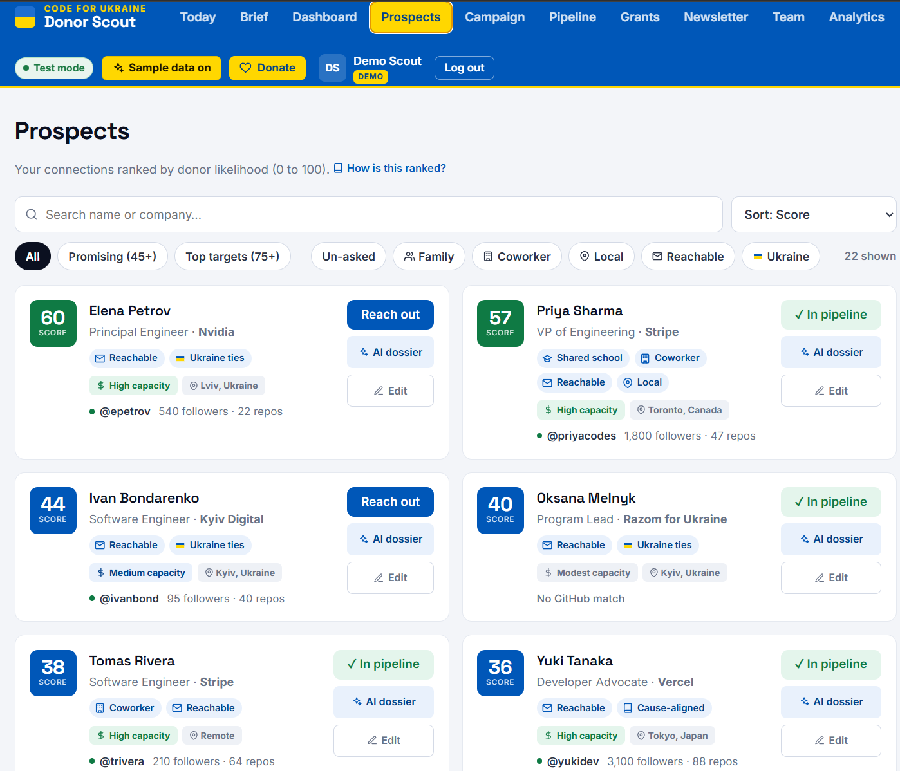
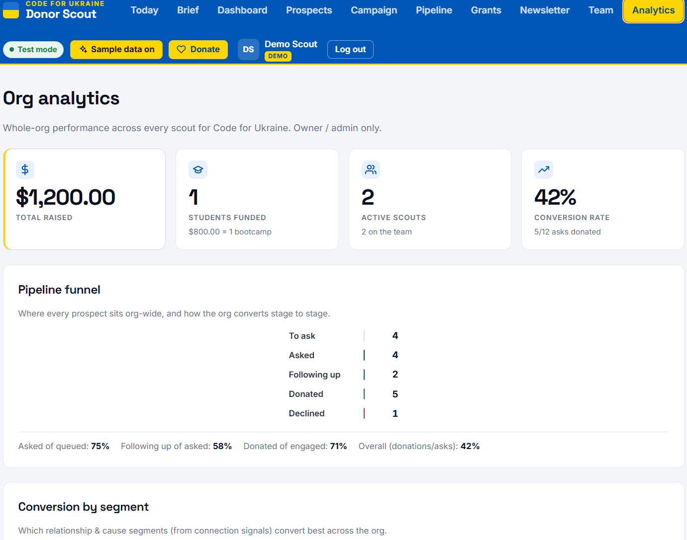
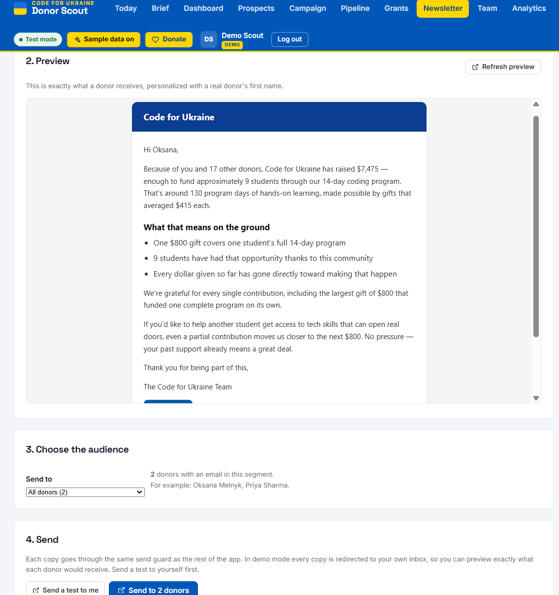

# Donor Scout

**A multi-tenant, AI-assisted peer-to-peer fundraising platform — rank your network by who'll actually say *yes*, draft the asks in your voice, and watch it add up to students funded.**

[](https://github.com/jgbergen18/linkedin-donor-scout/actions/workflows/ci.yml)
[](LICENSE)


I'm the program manager for **Code for Ukraine** (we fund Ukrainian students through a coding bootcamp), and running our donor cycle meant staring at a thousand LinkedIn contacts with no idea who to ask. So I built the tool I wished I had — and built it as a *platform*, so any nonprofit can run it, not just mine.



---

## Highlights

- **Relationship-led donor scoring.** Ranks your network 0–100 by *who you actually know* — family, school, coworkers, reachability — not by net worth. "How big an ask" (company tier, GitHub footprint, seniority) is a **separate capacity badge**, never the rank. The contrarian call that makes the product work.
- **AI woven through, optional everywhere.** In-voice outreach drafts, prospect dossiers, a daily brief, an autonomous campaign agent, and donor-personalized impact newsletters — all grounded in real data, all **degrade to heuristics / static copy** when no API key is present, all under a per-org spend budget guard.
- **A real multi-tenant SaaS, not a toy.** Every query is `org_id`-scoped; owner/admin/member roles; create-or-join onboarding; passwordless **magic-link** auth + email invitations; org-wide analytics for managers.
- **Three real integrations.** LinkedIn **OIDC** login, **GitHub** enrichment (throttled, rate-limit-aware, match-confidence scored so bad name-matches can't inflate a score), and **Zeffy** donation reconciliation from a real export. Each is optional and fails soft.
- **Cause-agnostic by design.** Retarget the entire tool to any nonprofit — impact economics + scoring signal — by editing **one config file**.
- **Built like production.** ~40 `node:test` suites in CI, a multi-stage **Docker** image with `/healthz`·`/readyz` probes + structured logging, and `helmet` / rate-limiting / session hardening.

## The problem it solves

Small nonprofits raise most of their money through **peer-to-peer asks**, but the people doing the asking hit the same three walls every time:

1. **They don't know who to ask** — a network of 1,000+ is impossible to triage, so they ask the same five people.
2. **They chase the wrong signal** — a VP they met once won't reply; a former coworker will. *Relationship predicts a yes far better than net worth.*
3. **Asks get dropped** — "sure, send the link" → no follow-up, no record, no idea what's converting.

Donor Scout fixes all three, and pins every dollar to a concrete unit (`$800 = one student / 14 days`) so impact is never abstract.

## Screenshots

**Org analytics** — whole-org performance across every scout (owner/admin only): totals, the pipeline funnel, stage-to-stage conversion, and per-segment conversion.



**AI impact newsletter** — grounded in real campaign numbers and personalized per donor, sent through the same send-guard as everything else (redirected to your own inbox in demo mode).



## Tech stack

| Layer | Choices |
| --- | --- |
| **Frontend** | React 18, Vite, React Router — hand-written JSX/CSS, no UI library |
| **Backend** | Node + Express (ESM), single-origin (API + built SPA on one server) |
| **Data** | SQLite via `better-sqlite3` (WAL), prepared statements, versioned re-scoring |
| **Auth** | LinkedIn OIDC · passwordless magic-link · email invitations · `passport` sessions (SQLite store) |
| **AI** | Anthropic API — tiered models, structured output, budget guard, graceful degradation |
| **Integrations** | GitHub REST/Search API · Zeffy (donation form + CSV reconcile) |
| **Ops** | Docker (multi-stage), GitHub Actions CI, `helmet` · rate-limit · `/healthz` / `/readyz` · structured logs |
| **Tests** | Node's built-in runner (`node:test`), ~40 suites, no runtime test deps |

## Architecture

```
Browser — React 18 + Vite SPA (client/)
   │  JSON over a same-origin cookie session
   ▼
server.js — Express (Node, ESM)
   ├─ helmet · cors · rate-limit · express-session (SQLite store) · passport
   ├─ orgScope(req) / requireOrgRole      ← every query filters by org_id
   ├─ scoreProspect() → component sub-scores → strategy registry → rank
   ├─ lib/ai.js  (model tiers · budget guard · graceful degradation)
   └─ SQLite (better-sqlite3, WAL): organizations · org_config · users ·
        identities · connections · referrals · teams · code_x_impact ·
        contact_history · voice_profiles · ai_usage · sessions · audit_log …
   ↕ external, all optional: LinkedIn OIDC · GitHub · Anthropic · Zeffy (CSV)
```

- **Single origin** — Express serves the API *and* the built SPA, so the session cookie just works (no CORS); dev uses a Vite proxy.
- **Multi-tenant by construction** — `org_id` scoping is enforced on every data query; roles gate org-level actions.
- **Graceful degradation as a rule** — missing GitHub / Anthropic / LinkedIn / email credentials never break the app; features fall back to heuristics or console output.

Deep dives live in [`docs/`](docs/) — [architecture](docs/architecture.md), [data model](docs/data-model.md), [auth](docs/auth.md), [multi-tenancy](docs/multi-tenancy.md), [AI engine](docs/ai-engine.md), [strategies](docs/fundraising-strategies.md), [containerization](docs/containerization.md).

## Engineering notes

A few decisions I'd point to in a code review:

- **Rank by relationship, not capacity.** The first version ranked by wealth signals and surfaced impressive strangers who'd never reply. Splitting the score into *affinity → rank* and *capacity → suggested ask* is the single change that made the output useful.
- **Trustworthy enrichment.** A GitHub name-search is noisy, so every match carries a confidence score and a low-confidence hit contributes **zero** until a human confirms it — the score can't be silently fooled.
- **One config file = one nonprofit.** Everything cause-specific (impact economics, the cause-affinity signal, the donation link) lives in [`cause.config.js`](cause.config.js); the scoring/pipeline/impact engine knows nothing about Ukraine or bootcamps.
- **I chose not to scrape.** LinkedIn only exposes 1st-degree connections via the official export, not an API. Crawling friends-of-friends would violate ToS and harvest non-consenting data, so I scale via a **team model** (more volunteers, each their own network) instead.

## Live demo & run it

**▶ Live demo:** _one click below spins up a free, HTTPS-hosted copy (no secrets needed) — the live URL gets pinned here once it's up._

[](https://render.com/deploy?repo=https://github.com/jgbergen18/donor-scout-platform)

Or run it locally — no accounts or API keys needed (demo login + one-click sample data work offline; every integration degrades gracefully):

```bash
docker compose up --build       # → http://localhost:5000  ("Continue in demo mode")
```

<details>
<summary>Without Docker (two terminals)</summary>

```bash
npm install && npm run dev                          # API  :5000
npm --prefix client install && npm --prefix client run dev   # SPA :5173 ← open this
npm test                                            # ~40 node:test suites
```
</details>

Copy `.env.example` → `.env` to enable the optional integrations (LinkedIn, GitHub, Anthropic, email); see that file for documented keys + AI cost controls.

## Project status — real vs. prototype

- **Real:** LinkedIn OIDC + magic-link auth, GitHub enrichment, Zeffy reconciliation against a genuine export, AI drafting (with fallback), multi-tenant org scoping + roles, the full scoring/pipeline/impact/analytics logic, security middleware, Docker + health probes, and ~40 CI test suites.
- **Prototype / planned:** LinkedIn yields only 1st-degree connections (export, not API); the **team leaderboard's teammates are seeded sample data**; Okta SSO / SCIM and a Postgres migration are designed-and-documented but not built; email uses a console adapter until a provider key is set.

## Docs

- [`docs/`](docs/) — full technical documentation (architecture, data model, auth, multi-tenancy, AI engine, strategies, containerization, roadmap).

## License

[MIT](LICENSE) © 2026 Jamie Bergen — built solo as a portfolio project.
