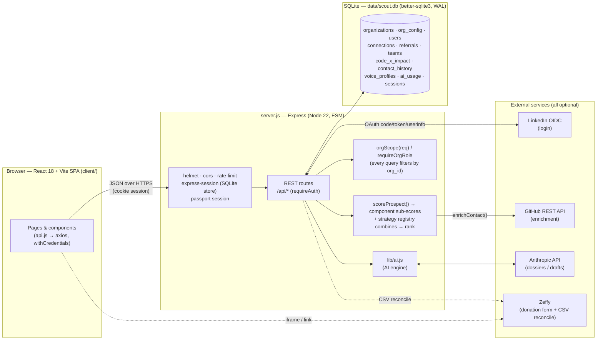

# Donor Scout — Technical Documentation

Donor Scout is a **peer-to-peer fundraising web app for nonprofits**. A volunteer ("scout")
imports their LinkedIn connections, the app ranks them — by **relationship strength** by default,
with other selectable strategies — the scout runs an outreach pipeline, and impact is tracked in
concrete units (`$800 = 1 student funded`). The reference deployment is **Code for Ukraine**, but
the tool is cause-agnostic and **multi-tenant**: each nonprofit is an org, and everything
cause-specific lives in per-org config (cloned from [`cause.config.js`](../cause.config.js)).

These docs describe the system **as built**, plus the **approved re-architecture** that this round
implements: real multi-tenancy (enforced org-scoping + roles + onboarding) and a pluggable
fundraising-strategy abstraction.

## Index

| Doc | What it covers |
| --- | --- |
| [architecture.md](./architecture.md) | Request lifecycle, auth (LinkedIn OIDC + demo), SPA↔API, integrations, and how org-scoping + the strategy layer sit in the request path |
| [auth.md](./auth.md) | **SaaS auth Phase 1 — IN PROGRESS** — all sign-in methods (demo, LinkedIn OIDC, magic-link), the `identities` model, magic-link + invitation sequence diagrams, the hash→email→consume token lifecycle, deactivation + audit log, and the console-default Mailer (Adapter) with the real-provider seam; notes where Phase 2 Okta plugs in |
| [data-model.md](./data-model.md) | The SQLite schema as an ER diagram + per-table notes, incl. roles/strategy columns, org-level config, and the Phase 1 auth tables (`identities`, `magic_link_tokens`, `invitations`, `audit_log`, `users.is_active`) |
| [multi-tenancy.md](./multi-tenancy.md) | **CURRENT PRIORITY** — the org model, owner/admin/member roles, create/join onboarding, and the **data-isolation convention** every query must follow |
| [onboarding-and-help.md](./onboarding-and-help.md) | **SHIPPED** — self-serve first-run checklist (every step DERIVED from real, org-scoped data; `GET /api/onboarding`), the persisted dismiss flag (`users.onboarding_dismissed` + `POST /api/onboarding/dismiss`), and the in-app help affordances (`HelpTip` / `HelpPanel`) |
| [fundraising-strategies.md](./fundraising-strategies.md) | **SHIPPED** — the Strategy pattern: component sub-scores, the strategy registry, select→persist→re-score, and why Relationship-first stays the default |
| [org-analytics.md](./org-analytics.md) | **SHIPPED** — the owner/admin org/manager analytics dashboard (`GET /api/orgs/analytics`): stage funnel + conversion, org totals (raised/beneficiaries/active scouts/conversion), per-segment conversion (by `score_reasons`), and the per-scout breakdown — org-scoped, members 403 |
| [ai-engine.md](./ai-engine.md) | How `lib/ai.js` works — model tiers, budget guard, `generateJSON`/`generateText`, structured output, graceful degradation — and how the Dossier feature uses it |
| [ai-outreach-drafts.md](./ai-outreach-drafts.md) | **IMPLEMENTED** — AI Outreach Drafts (in-voice, grounded asks): `POST /api/connections/:id/draft` + the modal's "Draft in my voice" button |
| [thank-you-stewardship.md](./thank-you-stewardship.md) | **IMPLEMENTED** — Thank-You / Receipt Stewardship: `thanked_at`, `POST /api/referrals/:id/thank-you` (in-voice, grounded, static fallback), the acknowledgement receipt (not a tax document), and the "donors awaiting thanks" surface |
| [containerization.md](./containerization.md) | **SHIPPED** — Docker image (multi-stage, native `better-sqlite3` build, single-origin SPA serve, volume-backed SQLite) + Colima local runtime, prod-vs-local cookie notes, the **observability** endpoints (`/healthz`, `/readyz`, structured request logging) + the `/healthz` `HEALTHCHECK` |
| [postgres-migration.md](./postgres-migration.md) | **PLAN (needs greenlight)** — the honest Postgres migration path: why it's hard (synchronous `better-sqlite3` → async driver across ~374 query sites + 17 transactions), the **repository-seam** approach + the **stay-on-SQLite + Litestream** alternative and when each wins, a phased plan, CI parity testing against a Postgres service, data migration, risks/rollback, effort, and a current-vs-target mermaid. The **observability** half of P1-5 is shipped (see containerization.md) |
| [saas-auth-okta.md](./saas-auth-okta.md) | **PLAN (Phase 1 IN PROGRESS)** — user accounts + per-org Okta SSO (BYO IdP) to make this a SaaS: identity model, login flows, user lifecycle, security, phased rollout. Phase 1 (accounts/invites/magic-link/deactivate/audit) is being built — see [auth.md](./auth.md); Phase 2 (Okta) remains PLAN |

## System overview

The whole backend is a single `~2200`-line ESM Express file (`server.js`) over a `better-sqlite3`
database. The frontend is a React 18 + Vite SPA in `client/`. Three external integrations are all
**optional and degrade gracefully** when their credentials are absent: GitHub enrichment
(`GITHUB_TOKEN`), the Anthropic API (`ANTHROPIC_API_KEY`), and LinkedIn OIDC login
(`LINKEDIN_CLIENT_ID`/`SECRET`). Zeffy is the donation processor; the app links/embeds its form and
reconciles donations from an exported CSV (no live API).

## Hard constraints (for anyone changing the code)

- Backend must keep booting: `node --check server.js` and a boot smoke test.
- Client must keep building: `cd client && npm run build`.
- AI features **must** degrade gracefully with no `ANTHROPIC_API_KEY`.
- Match the existing style: single-file Express, `better-sqlite3` prepared statements, ESM imports,
  heavy explanatory comments.
- Tests use Node's built-in runner (`node:test` + `node:assert`); no new runtime dependencies.

## Build sequence (two passes)

The work ships in two passes against this design.

**Pass 1 — Multi-tenancy (SHIPPED):**
1. **Real multi-tenancy** — `org_id` scoping enforced on **every** data query, owner/admin/member
   roles, and org create/join onboarding (with a minimal ProfilePage UI + post-login nudge). The
   headline privacy work. See [multi-tenancy.md](./multi-tenancy.md).
2. **Scoring foundation for strategies** — `scoreProspect` now persists the three component
   sub-scores (affinity / propensity / capacity), the propensity reader uses **per-org cause
   config**, and the **org-level** default strategy (`org_config.defaultStrategy`) + resolver
   (`strategyForUser`) land. `donor_likelihood_score` is unchanged relationship-first output.
3. **Test harness** — Node's built-in runner (`node:test` + `node:assert`): org-isolation,
   onboarding, role-permission, and scoring suites; `npm test` script (no new runtime deps).

**Pass 2 — Pluggable fundraising strategies (SHIPPED):** the strategy registry
(`lib/strategies/index.js`) that recombines the persisted component sub-scores into a new rank, the
**per-user** picker (`users.strategy`/`strategy_weights`, `GET /api/strategies`,
`POST /api/profile/strategy` → `rescoreUserConnections`), and the ProfilePage `StrategyPicker` UI,
with **Relationship-first** as the recommended default. Five strategies ship (relationship_first,
capacity_first, cause_fit, balanced, custom_weights); `getStrategy` falls back to the default for any
unknown key. See [fundraising-strategies.md](./fundraising-strategies.md).

## SaaS auth (Phase 1 — IN PROGRESS)

Building Phase 1 of [saas-auth-okta.md](./saas-auth-okta.md): real user accounts + team onboarding
**without requiring LinkedIn/demo** — passwordless email **magic-link** auth, owner/admin email
**invitations**, an **`identities`** table (credential decoupled from person), per-user
**deactivation** (`is_active`), a minimal **`audit_log`**, and a pluggable console-default **Mailer**
(Adapter pattern; real-provider SMTP seam, no new runtime dependency). All built in the existing
single-file `server.js`, reusing `orgScope(req)`/`requireOrgRole()`, keeping demo + LinkedIn logins
and all existing offline `node:test` tests working. Full design in [auth.md](./auth.md). **Phase 2
(Okta SSO / BYO IdP) and Phase 3 (SCIM/SAML/custom domains/billing) remain PLAN.**

## Known gaps (documented, out of scope this round)

- **Team leaderboard uses seeded/fake data** (demo teammates).
- **Okta SSO / SCIM / SAML** (Phase 2–3 of the SaaS auth plan); **multi-org membership** for a single
  user; bulk data migration between orgs; passwords (locked: magic-link only); a real SMTP/provider
  mailer adapter (documented seam only); an audit-log read/export endpoint (table scaffolded only).
</content>
</invoke>
