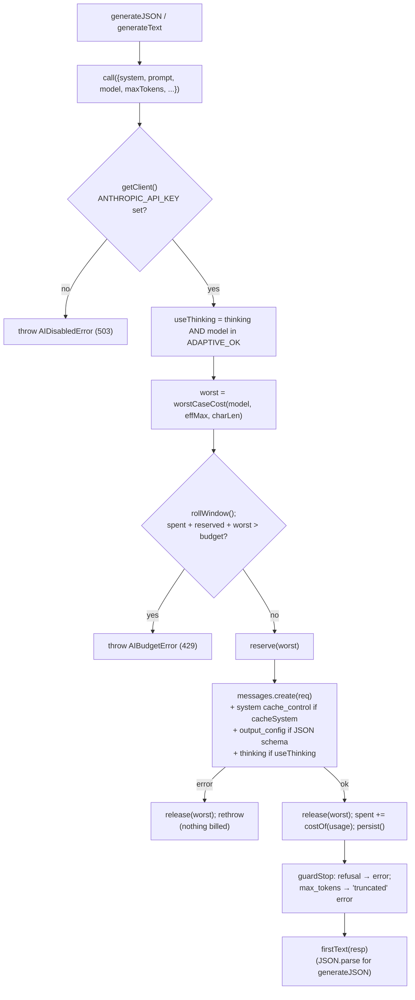
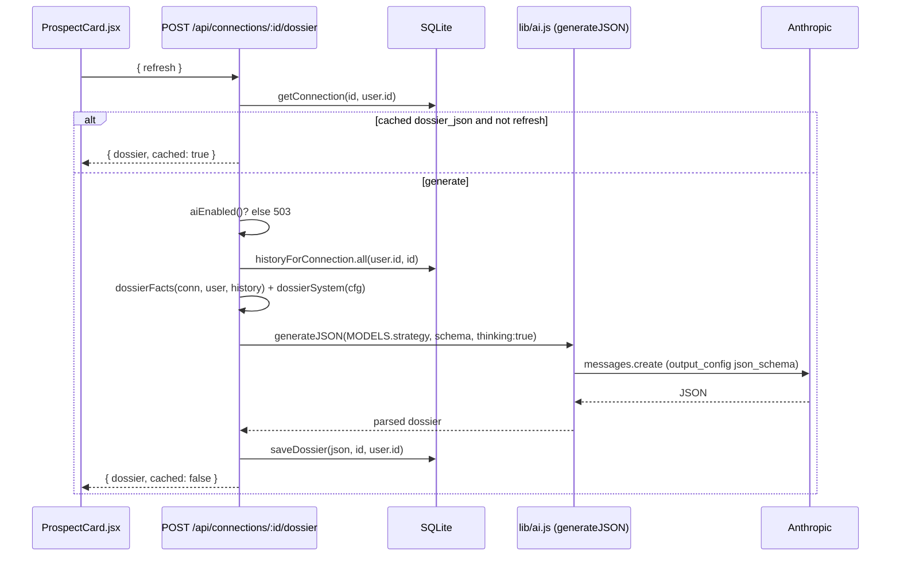

# AI engine — `lib/ai.js`

[← Docs index](./README.md) · [Architecture](./architecture.md) · [Data model](./data-model.md)

`lib/ai.js` is the **single entry point for every Claude call** in Donor Scout. Feature code never
imports the Anthropic SDK directly — it asks the engine for "JSON matching this schema" or "text",
and the engine owns model choice, structured output, prompt caching, the cost guard, and graceful
degradation. (It mirrors how GitHub enrichment degrades without a token.)

## Public surface

```js
import {
  aiEnabled,          // () => boolean  (true iff ANTHROPIC_API_KEY is set)
  generateJSON,       // ({system, prompt, schema, model, maxTokens, cacheSystem, thinking}) => parsed JSON
  generateText,       // ({system, prompt, model, maxTokens, cacheSystem, thinking}) => string
  mapWithConcurrency, // (items, limit, mapper) => results[]  (bounded fan-out)
  status,             // () => { enabled, tier, models, budgetUsd, spentUsd, remainingUsd }
  MODELS,             // { strategy, draft }  (tier-dependent)
  configureSpendStore,// (store) => void  — wire a persistent budget store at boot
  AIDisabledError,    // status 503
  AIBudgetError,      // status 429
} from './lib/ai.js';
```

## Model tiers

`AI_MODEL_TIER` (default `economy`) selects a pair of models so cost can be dialed **without
touching feature code**:

| Tier | `MODELS.strategy` (judgement-heavy) | `MODELS.draft` (high-volume) |
| --- | --- | --- |
| `economy` (default) | `claude-sonnet-4-6` | `claude-haiku-4-5` |
| `standard` | `claude-opus-4-8` | `claude-sonnet-4-6` |

Pricing per 1M tokens is tracked per model (input/output), with cache reads ~0.1× input and cache
writes ~1.25× input — used by the budget guard.

### Adaptive thinking is capability-gated

Only models in `ADAPTIVE_OK` (the 4.6+ / Fable family) support adaptive thinking. **Haiku 4.5 — the
default `draft` model — does NOT**; sending it thinking 400s. So `call()` attaches
`thinking: { type: 'adaptive' }` **only** when `thinking` is requested AND the chosen model supports
it. When thinking is on, `max_tokens` is floored at 4000 so reasoning isn't truncated before the
answer.

**Implication for callers:** features on `MODELS.draft` (Haiku, economy tier) must pass
`thinking: false`. The Dossier runs on `MODELS.strategy` with `thinking: true`; the planned drafts
run on `MODELS.draft` with `thinking: false`.

## Budget guard — rolling 24h dollar budget with pre-flight reservation

`AI_DAILY_BUDGET_USD` (default `$5`) caps spend over a rolling 24h window. Two layers prevent
overshoot:

1. **Pre-flight reservation** — before each call, `worstCaseCost(model, maxTokens, charLen)` computes
   the worst case (full `max_tokens` of output + an input estimate). `reserve()` throws
   `AIBudgetError` if `realized spent + in-flight reservations + this worst case` would exceed the
   budget. This blocks both a single oversized call and N concurrent calls all passing a stale check.
2. **Post-call truing-up** — after success, the reservation is released and replaced with the
   **actual** measured cost from `resp.usage`.

State is optionally persisted via `configureSpendStore`. `server.js` wires it to the single-row
`ai_usage` table so the budget survives restarts / a crash loop can't re-spend. The provider-side
spending limit remains the ultimate backstop.



## Structured JSON output

`generateJSON` constrains the model with the Messages API
`output_config.format = { type: 'json_schema', schema }`, so the first text block is guaranteed
parseable. **Schema limits the engine relies on** (callers must honor them):

- Every object needs `additionalProperties: false` **and** `required`.
- **No** `minLength` / `maxLength` / `minimum` / `maximum` — keep such guidance in the **prompt
  text**, not the schema.

`generateText` is the free-form path (no schema) — used for messages/drafts.

## Prompt caching & error mapping

- `cacheSystem: true` (default) marks the system prompt with `cache_control: ephemeral` (5-min TTL),
  cheap when the same system prompt is reused across many calls (e.g. one per prospect).
- Errors are typed so routes can map cleanly: `AIDisabledError` → **503**, `AIBudgetError` → **429**.
  `guardStop()` turns a `refusal` or `max_tokens` stop into a plain `Error` (routes map other errors
  to **502**).

## Graceful degradation (the contract every AI feature follows)

When `ANTHROPIC_API_KEY` is unset, `aiEnabled()` is `false`, `status()` reports `enabled: false`, and
the app still runs end to end. **Routes check `aiEnabled()` up front and return 503**, and the UI
falls back to the existing heuristic/template behavior. `GET /api/ai/status` (auth-gated) exposes
`{ enabled, tier, models, budgetUsd, spentUsd, remainingUsd }` for the UI.

## Worked example — the AI Donor Dossier (already shipped)

The Dossier proves the full pattern end to end and is the template for the planned drafts feature.

- **Route:** `POST /api/connections/:id/dossier` (`requireAuth`).
- **Caching:** returns the cached `dossier_json` unless `{ refresh: true }`; on success saves to the
  `connections` row (`saveDossier`).
- **Facts assembly** (`dossierFacts(conn, scout, history)`): only facts the app holds — the contact
  (name/company/role/location/github + parsed `score_reasons` as `relationshipSignals`), the scout's
  own profile (`you`), and `sharedHistory` from `contact_history` (counts, last interaction,
  snippets). Nothing else, so the model has nothing to invent.
- **System prompt** (`dossierSystem(cfg)`): reads impact economics from `orgConfigForUserId()` so the
  ask is sized to real units (`$800 = 1 student`), states the relationship-led + **no-fabrication**
  principles, and defines the output fields.
- **Generation:** `generateJSON({ model: MODELS.strategy, system, prompt, schema: DOSSIER_SCHEMA,
  maxTokens: 1200, thinking: true })`. `DOSSIER_SCHEMA` →
  `{ summary, whyTheyMightGive, suggestedAsk, conversationHooks[], confidence }`.
- **Error mapping:** `aiEnabled()` false → 503; `AIBudgetError` → 429; `AIDisabledError` → 503; any
  other error → 502 (`console.error`-logged).



> **Note on the current UI:** the client does **not** pre-check `/api/ai/status` before showing the
> dossier button — `ProspectCard.jsx` always renders it and surfaces an inline error on a 503/429.
> The drafts design doc proposes the same defensive try/catch + fallback approach so the feature is
> robust regardless of whether a status pre-check is added.

Next: the design for the in-voice outreach drafts → [ai-outreach-drafts.md](./ai-outreach-drafts.md).
</content>
