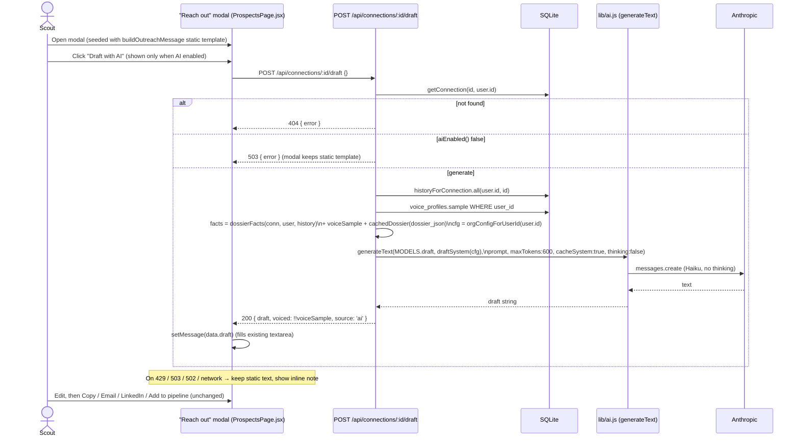

# Design — AI Outreach Drafts (in-voice, grounded asks)

[← Docs index](./README.md) · [Architecture](./architecture.md) · [Data model](./data-model.md) ·
[AI engine](./ai-engine.md)

> **Status: IMPLEMENTED.** Shipped on `rebuild/strategy-multitenancy`. The sections below are the
> design as built; see **"What shipped"** immediately following for the as-built summary.

## What shipped

- **Endpoint:** `POST /api/connections/:id/draft` (`requireAuth`), placed right after the AI-dossier
  block in `server.js`. Org-scoped via `getConnection.get(id, req.user.id, orgScope(req))` — a
  cross-org id returns **404** (existence not leaked, even with AI off). Returns
  `{ draft, voiced, source: 'ai' }`. Maps `aiEnabled()===false → 503`, `AIBudgetError → 429`,
  `AIDisabledError → 503`, any other error → **502** (`console.error`-logged) — mirroring the dossier.
- **Generation:** `generateText({ model: MODELS.draft, system: draftSystem(cfg, voiced), prompt,
  maxTokens: 600, cacheSystem: true, thinking: false })`. No direct SDK call; `generateText` was added
  to the `lib/ai.js` import block. The draft is **transient** — no new columns, no migration.
- **Grounding inputs (reused, not re-gathered):** `draftContext()` is a thin wrapper around the
  dossier's `dossierFacts(conn, req.user, historyForConnection.all(user, org, id))` (connection row,
  `score_reasons` relationship signals, scout profile, shared `contact_history`), plus the scout's
  `voice_profiles.sample` (the voice signal → `voiced: true` only when present) and the cached
  `dossier_json` (`whyTheyMightGive`/`suggestedAsk`/`conversationHooks`) when present. Absent
  voice/dossier resolve to `null` (Null Object). Both `draftContext` and `draftSystem` are exported as
  pure functions via `__draftInternals` for offline unit tests.
- **Patterns:** **Facade** (`lib/ai.js` only); **Template Method** (reuse `dossierFacts`, wrap with
  voice + dossier); lightweight **Strategy** (the `voiced` boolean picks the in-voice vs. warm-neutral
  register at the prompt level — no class hierarchy); **Null Object** (missing inputs → `null`);
  project **graceful-degradation contract** (the modal keeps the static template on any failure).
- **UI (`client/src/pages/ProspectsPage.jsx`):** the "Reach out" modal seeds today's static
  `buildOutreachMessage()` template, then shows a **"Draft in my voice"** button (only when
  `GET /api/ai/status` reports `enabled`). Click → `POST .../draft` → fills the existing editable
  textarea, with an inline **"AI draft — review before sending."** note (or "…written in your voice…"
  when `voiced`). On any error it keeps the static template and shows
  "Couldn't draft with AI — using the standard template."
- **Tests (`test/drafts.test.js`, in the `npm test` script):** 503 without a key; cross-org id → 404;
  pure `draftContext` includes the voice sample + real facts and contains no
  wealth/income/net-worth/salary keys; `draftSystem` states the no-fabrication rule and switches
  register on the voice sample. No live API call; no new runtime deps.

---

> **Original design (approved by the PM).** Retained below as the spec the implementation followed.
> Note: a couple of signatures shown below are pre-org-scoping shorthand — as built, the connection
> lookup and history query are org-scoped (`getConnection.get(id, user.id, orgId)` /
> `historyForConnection.all(user.id, orgId, id)`).

## Problem

The "Reach out" modal (`client/src/pages/ProspectsPage.jsx`) seeds a single **static** template from
`buildOutreachMessage()` (`client/src/outreach.js`) — identical for every prospect except the first
name and the scout's signature. This is the highest-friction, lowest-quality step in the funnel:
relationship-led fundraising lives or dies on the ask sounding like a real note from someone who
actually knows the person. Meanwhile two captured-but-unused datasets exist precisely to fix this:
`voice_profiles.sample` (the scout's own past messages) and `contact_history` (per-contact
counts/snippets). The Dossier already produces the strategic inputs a good ask is built from
(`whyTheyMightGive`, `suggestedAsk`, `conversationHooks`) — we throw all of it away at the moment it
matters most.

## Recommendation (scope)

A new endpoint `POST /api/connections/:id/draft` generates a short, warm, ready-to-send message **in
the scout's own voice**, grounded **only** in known facts, reusing `lib/ai.js` `generateText()` on
`MODELS.draft`. The "Reach out" modal gains a **"Draft with AI"** button that drops the result into
the **existing editable textarea**. The human always edits before copy/send (no auto-send). When AI
is unavailable (no key / no voice sample / budget exhausted / any error), the modal silently keeps
today's static `buildOutreachMessage()` template. **Purely additive; degrades to current behavior.**

**Explicitly out of scope:** auto-generating on modal open, multi-variant generation / tone
selectors, persisting drafts (the draft is transient — only the dossier stays cached), changes to the
thank-you flow, any send automation, and enforcing `org_id` scoping.

## Request flow



## API contract

### `POST /api/connections/:id/draft` (new, `requireAuth`)

Request body: `{}` (no fields required; ignore any future-proofing fields this round).

| Condition | Status | Body |
| --- | --- | --- |
| `getConnection.get(id, req.user.id)` is null | **404** | `{ error }` |
| `aiEnabled()` is false | **503** | `{ error: 'AI drafting is off. Add an ANTHROPIC_API_KEY to your .env to enable it.' }` |
| Success | **200** | `{ draft: string, voiced: boolean, source: 'ai' }` |
| `generateText` throws `AIBudgetError` | **429** | `{ error: e.message }` |
| `generateText` throws `AIDisabledError` | **503** | `{ error: e.message }` |
| Any other error | **502** | `{ error: 'Could not generate a draft — please try again shortly.' }` (`console.error`-logged) |

- `draft` is a multi-line, ready-to-send message addressed to the prospect's **first name** and
  signed with the scout's **first name**.
- `voiced` is `true` **only** when a `voice_profiles.sample` was used to shape the tone.
- The draft is **NOT cached** — no new columns, no schema migration.

### Existing endpoints reused (unchanged)

- `GET /api/ai/status` → `{ enabled, tier, models, budgetUsd, spentUsd, remainingUsd }` — gates the
  client button.
- `POST /api/connections/:id/dossier` — its cached `dossier_json` is an **input** to the draft.
- `POST /api/referrals { connectionId }` — still the "Add to pipeline" action in the same modal.

### Client contract (`ProspectsPage.jsx`)

```js
// On click "Draft with AI":
setDrafting(true);
try {
  const { data } = await api.post(`/api/connections/${target.id}/draft`);
  setMessage(data.draft);          // fills the EXISTING editable textarea
} catch {
  // keep current message (static buildOutreachMessage template); show inline note
  setDraftNote('Couldn’t draft with AI — using the standard template.');
} finally {
  setDrafting(false);
}
```

The button is rendered **only when AI is reported enabled**. The static template stays the seeded
default, so the modal is fully usable with AI off.

## Data the draft draws on

Reuse the **existing** fact assembly — no duplicate fact-gathering, no new SQL columns:

```js
const facts = dossierFacts(conn, req.user, historyForConnection.all(req.user.id, id));
const voiceSample  = db.prepare('SELECT sample FROM voice_profiles WHERE user_id = ?')
                       .get(req.user.id)?.sample || null;
const cachedDossier = safeParse(conn.dossier_json, null); // whyTheyMightGive/suggestedAsk/conversationHooks
const cfg = orgConfigForUserId(req.user.id);              // impact economics
```

So the model sees: the connection row (name/company/role/location/github), the relationship signals
from `score_reasons`, the shared `contact_history` (counts, last interaction, snippets), the cause's
impact economics, the scout's profile, the scout's voice sample, and the cached dossier when present.
**Nothing the app doesn't hold.**

## System prompt (`draftSystem(cfg)`)

Build it analogously to `dossierSystem(cfg)` (read `cfg.impact` for the economics), enforcing:

- **No fabrication** — never invent an employer, income, net worth, or personal detail; use only the
  provided facts. If the relationship signal is thin, keep the note short and generic rather than
  manufacturing intimacy.
- **In-voice** — when a voice sample is provided, match the scout's tone/length/punctuation; when it
  is absent, default to a warm, plain, friendly register (and the route returns `voiced: false`).
- **Relationship-over-wealth** — size the ask to the cause's impact units **and** to how well the
  scout actually knows the person; closeness, not capacity, drives the warmth. No guilt-tripping or
  false urgency; never imply surveillance of the contact's wealth/employer.
- **Format** — address by first name, sign with the scout's first name, ready to paste/send.

Generation call:

```js
const draft = await generateText({
  model: MODELS.draft,        // Haiku in economy tier — high-volume, no thinking
  system: draftSystem(cfg),
  prompt: 'Write the outreach message using ONLY these facts (JSON). Do not invent details…\n\n'
        + JSON.stringify({ facts, voiceSample, dossier: cachedDossier }, null, 2),
  maxTokens: 600,
  cacheSystem: true,
  thinking: false,            // REQUIRED — MODELS.draft (Haiku) is not ADAPTIVE_OK
});
```

> ⚠️ **Builder gotcha — import `generateText`.** `server.js` currently imports only `generateJSON`
> from `lib/ai.js`. Add `generateText` to that import block. (`MODELS`, `aiEnabled`,
> `AIBudgetError`, `AIDisabledError` are already imported.)

> ⚠️ **Placement.** Put the route + `draftSystem` near the existing **"AI donor dossier"** block, so
> it sits after `dossierFacts`, `historyForConnection`, `safeParse`, and `getConnection` are defined.
> `getConnection` is declared *below* the dossier block (line ~1958); since the route runs at
> request time, top-level ordering is fine, but keep the helper definitions ahead of first use to
> match the file's style.

## Recommended design patterns (judicious, not gratuitous)

| Pattern | Where | Why |
| --- | --- | --- |
| **Facade** (already in place) | `lib/ai.js` is the AI facade; call `generateText()` only | Keeps model/budget/caching/degradation in one place. Do **not** reach for the SDK. |
| **Template Method / shared builder** | `dossierFacts()` reused verbatim; add `voiceSample` + `dossier` **around** it (a thin wrapper), not a new fact-gatherer | The spec mandates reusing the existing assembly — one source of truth for "what facts we hold." |
| **Strategy** (lightweight) | `voiced` branch: pick the in-voice vs. neutral register based on whether a voice sample exists. Keep it as a prompt-level branch, **not** a class hierarchy | Two behaviors, one prompt — a full Strategy class would be over-engineering for a single boolean. |
| **Null Object** | `voiceSample`/`cachedDossier` resolve to `null`; the prompt treats absence as "no extra signal" | Avoids special-casing in the route and lets the model degrade smoothly when data is missing. |
| **Graceful-degradation contract** (project convention) | Route returns 503/429/502 per the table; client try/catch keeps the static `buildOutreachMessage()` | Mirrors the Dossier and the project-wide "AI is optional" rule. |

**Avoid:** a new persistence layer, a draft cache/column, a generic "message generator" abstraction,
or a client-side AI-status store — none are needed for one button → one draft → one editable box.

## Acceptance / verification checklist (for the Builder)

- [ ] `POST /api/connections/:id/draft` returns `{ draft, voiced, source:'ai' }`; addressed to the
      prospect first name, signed with the scout first name; `voiced` true only with a voice sample.
- [ ] Uses `generateText()` on `MODELS.draft` with `cacheSystem:true`, `thinking:false`; **no** direct
      SDK call.
- [ ] Prompt grounded only in app-held facts; `draftSystem` forbids inventing
      employer/income/net-worth/personal facts; ask sized to impact units + relationship closeness.
- [ ] Error mapping: `aiEnabled()` false → 503; `AIBudgetError` → 429; `AIDisabledError` → 503; other
      → 502 (`console.error`-logged) — mirroring the dossier route.
- [ ] Reuses `historyForConnection`, `dossierFacts`, and reads `dossier_json`; no new columns / migration.
- [ ] Modal "Draft with AI" button shown only when AI enabled; loading state; success replaces
      textarea contents; any error keeps the static template and shows an inline note.
- [ ] No regression: dossier route, `dossier_json`/`dossier_at`, `withReasons()` shape, ProspectCard
      dossier UI untouched.
- [ ] `node --check server.js` passes and the server boots; `cd client && npm run build` passes.
- [ ] `node:test` + `node:assert` tests + a `"test"` script in `package.json` (no new runtime deps):
      **(a)** draft prompt/facts assembly contains the prospect name and excludes any field the app
      doesn't hold; **(b)** the route returns 503 when `aiEnabled()` is false; **(c)** the
      modal-facing fallback contract (static template used when AI unavailable) at a unit-testable
      seam (e.g. `buildOutreachMessage` remains the seed, or a pure `draftSystem`/facts-builder).

### Testing seams (no live API key needed)

- Extract `draftSystem(cfg)` and the facts/prompt builder as **pure functions** so they can be unit
  tested directly (assert the prompt JSON contains `contact_name`, omits net-worth/income keys, etc.).
- The 503 path is testable by importing the route with `aiEnabled()` false (no `ANTHROPIC_API_KEY`),
  or by asserting the guard returns before any SDK call.
- The static fallback is testable purely on the client side via `buildOutreachMessage()` (already a
  pure function in `client/src/outreach.js`).

## Nonprofit / ethics considerations

This feature touches real friendships, so the guardrails are load-bearing: **never fabricate** (facts
only; thin signal → short, generic note), **never creepy/manipulative** (a genuine warm note, not a
data-mined pitch; no implied surveillance, no guilt-tripping), **always human-edited** (lands in the
editable textarea, never auto-sent), **relationship-over-wealth** (ask sized to impact units *and*
closeness), **graceful degradation** (falls back to the proven template), and **privacy** (uses only
locally-stored, user-imported history + the user's own voice sample — both wipeable via
`DELETE /api/history`; nothing new persisted, so the "delete my data" promise holds).
</content>
