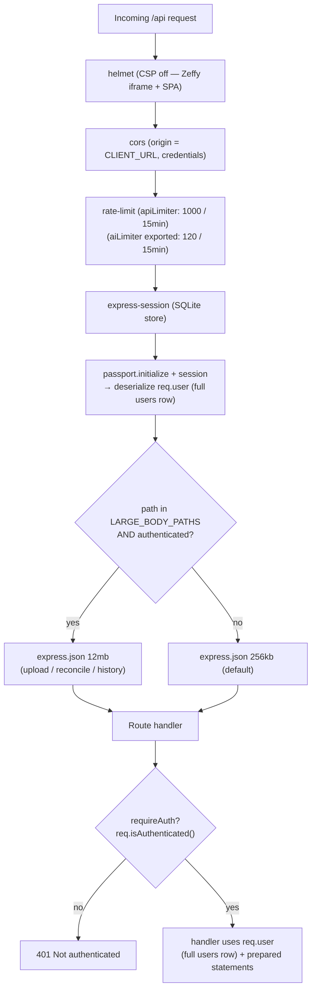
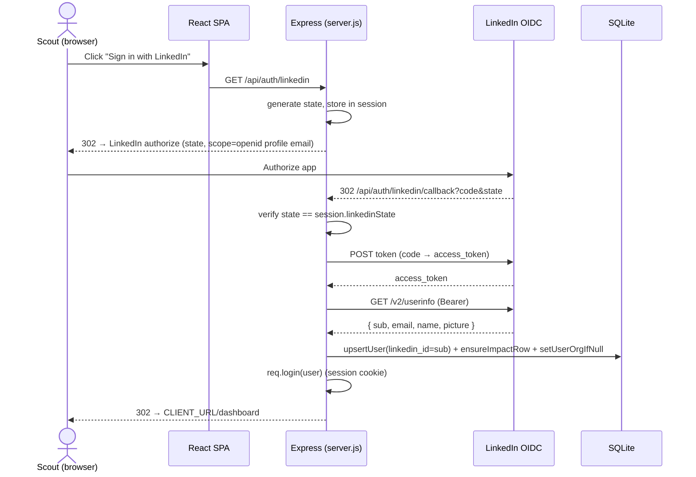
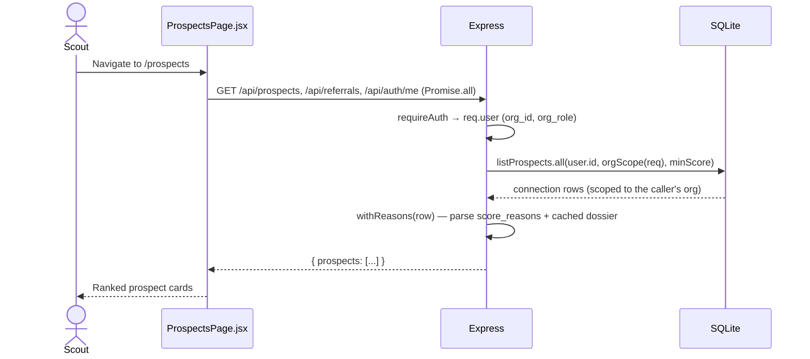

# Architecture

[← Docs index](./README.md) · [Data model](./data-model.md) · [AI engine](./ai-engine.md) ·
[Multi-tenancy](./multi-tenancy.md) · [Fundraising strategies](./fundraising-strategies.md)

Donor Scout is a **single-file Express backend** (`server.js`) serving JSON to a **React SPA**
(`client/`), backed by **SQLite** (`better-sqlite3`). This doc covers the request lifecycle, the two
auth paths, how the SPA talks to the API, the integrations, **enforced org-scoping**, and the
**pluggable scoring strategy** layer.

## Process & boot order

`server.js` executes top-to-bottom at boot (no framework lifecycle):

1. Load env (`dotenv/config`), import `cause.config.js` and `lib/ai.js`.
2. Open `data/scout.db`, set `journal_mode = WAL`, `CREATE TABLE IF NOT EXISTS …` for every table.
3. **Lightweight migrations**: `ensureColumn(table, col, type)` adds columns (incl. `dossier_json`,
   `dossier_at`, all `org_id` columns, plus the new `users.org_role`/`strategy`/`strategy_weights`,
   `organizations.join_code`, and `connections.affinity_score`/`propensity_score`) to pre-existing
   databases.
4. Seed the **default organization** from `cause.config.js`; backfill `org_id` on all rows, set
   `org_role='member'`, promote one owner per org, and generate org `join_code`s (idempotent).
   See [multi-tenancy.md](./multi-tenancy.md).
5. Wire the AI budget store: `configureSpendStore({ load, save })` persists spend to the `ai_usage`
   table so the daily budget survives restarts (see [ai-engine.md](./ai-engine.md)).
6. Prepare statements, define helpers (`scoreProspect`, GitHub enrichment, etc.).
7. Build the Express app (middleware → routes), serve the built SPA in production, `app.listen(PORT)`.

## Middleware pipeline

Order matters — the body-size selector deliberately runs **after** auth so anonymous callers can
never trigger the large-body parser.

Key facts:
- **`requireAuth`** gates every protected route; on success `req.user` is the **full `users` row**
  (passport `deserializeUser` returns `findUserById.get(id)`), which now carries `org_id` and
  `org_role`. **Org-scoping and role checks layer on top of `requireAuth`, never replace it** —
  `orgScope(req)` derives the tenant from `req.user.org_id`, and `requireOrgRole(...)` gates admin
  endpoints. See [multi-tenancy.md](./multi-tenancy.md#data-isolation--the-convention-the-builder-must-follow).
- Body limits: `256kb` default, `12mb` only for `/api/connections/upload`,
  `/api/donations/reconcile`, `/api/history/upload`.
- Sessions persist in SQLite (`better-sqlite3-session-store`) so logins survive restarts; cookie is
  `httpOnly`, `sameSite=lax`, `secure` in production, 7-day `maxAge`.

## Authentication

Two paths, both ending in `req.login(user)` (passport session):

1. **LinkedIn "Sign in with OpenID Connect"** — the OAuth dance is performed **manually** in the
   routes (not via `passport-openidconnect`, which the comments note is less reliable with
   LinkedIn). Passport only does session serialize/deserialize.
2. **Demo login** (`POST /api/auth/demo`) — a clearly-labeled fallback that upserts a fixed
   `demo-user`. Always available, even without LinkedIn credentials.

`GET /api/auth/config` reports `{ linkedinEnabled, githubEnrichment }` so the login page can show or
hide the LinkedIn button.

### LinkedIn OIDC sequence

On any failure the callback redirects to `CLIENT_URL/login?error=auth_failed&reason=…` so the cause
is visible rather than a generic redirect.

## SPA ↔ API

- The SPA uses a single axios instance, `client/src/api.js`, with `withCredentials: true` (cookie
  session) and `baseURL = VITE_API_URL || ''` (same-origin via the Vite dev proxy, or a split
  deployment).
- `client/src/App.jsx` bootstraps by calling `GET /api/auth/me` then `GET /api/auth/config`, holds
  `user` in state, and route-guards with a `RequireAuth` wrapper (React Router). Routes:
  `/login`, `/dashboard`, `/prospects`, `/pipeline`, `/team`, `/profile` (`/impact` → `/dashboard`).
- **In production** Express serves the built SPA (`express.static(clientDist)`) with an SPA
  fallback, so the API and client are same-origin.

### A typical authenticated request (Prospects page load)

`withReasons(c)` is the canonical connection-payload shaper: it JSON-parses `score_reasons` into a
tag array and attaches the cached `dossier` (renaming `dossier_json` away from the payload). **Any
new feature returning a connection should reuse it** to keep the payload shape consistent.

## Donor scoring (component sub-scores + pluggable strategy)

Scoring is split into two stages so a scout can eventually choose **how** prospects rank without
losing the relationship-led default:

1. **`scoreProspect(contact, scout, cfg)`** returns the three component sub-scores —
   `{ affinityScore, propensityScore, capacityScore, reasons, ... }` — computed **relative to the
   logged-in scout** (family / schoolmate / coworker / reachable-by-email / local for affinity;
   cause fit for propensity). The propensity reader now takes the **per-org cause config**
   (`getOrgConfig(orgId)` / `orgConfigForUserId()`), not the module-level `CAUSE` constants, so each
   tenant ranks against its own cause. The components persist as
   `affinity_score`/`propensity_score`/`capacity_score`.
2. **The final `donor_likelihood_score` (the rank)** is, in Pass 1, exactly the relationship-led
   sum (`min(100, affinity + propensity)`) — byte-for-byte identical to the previous shipped output.
   `capacity_score` remains **display / ask-sizing** — *who you know* qualifies the ask; *capacity*
   only sizes it.

> **Selectable strategy (shipped).** `scoreProspect` derives the three component sub-scores, then a
> **FundraisingStrategy** (a pure value object in `lib/strategies/index.js`) recombines them into the
> final `donor_likelihood_score`. The strategy is resolved per scout by `strategyForUser(user)`
> (user choice → `org_config.defaultStrategy` → `relationship_first`). The registry ships five
> strategies (relationship_first **[default/Recommended]**, capacity_first, cause_fit, balanced,
> custom_weights); `getStrategy(key)` falls back to the default for any unknown key. A scout picks
> one on ProfilePage via `GET /api/strategies` + `POST /api/profile/strategy`, which persists
> `users.strategy`/`strategy_weights` and calls `rescoreUserConnections` to re-rank only that scout's
> connections (org/user-scoped). Because the components are persisted, switching strategy *recombines*
> without re-deriving any signals (no GitHub calls). `relationship_first` reproduces the prior shipped
> rank byte-for-byte. See [fundraising-strategies.md](./fundraising-strategies.md) for the full
> design and the per-strategy formulas.

## Integrations

| Integration | How it's used | Degradation when unconfigured |
| --- | --- | --- |
| **LinkedIn OIDC** | Login (manual OAuth in routes) | Demo login still works; LinkedIn button hidden |
| **GitHub REST** | `enrichContact()` matches a connection to a GitHub profile (followers/repos/bio) for capacity signal; throttled + rate-limit aware | Unauthenticated client (lower limits, capped to 8 enrichments/upload); feature still runs |
| **Anthropic** | `lib/ai.js` — dossiers (and the planned drafts) | `aiEnabled()=false`; routes return 503; UI falls back to heuristics/templates |
| **Zeffy** | Donation form linked/embedded in the client; `POST /api/donations/reconcile` matches an exported donor CSV to referrals | N/A (CSV import is manual; no live API) |

## Multi-tenancy (ENFORCED) + roles + onboarding

This round makes org-scoping a first-class, enforced control — the headline privacy work.

- Every org-owned table carries `org_id`; a `default` org is seeded from `cause.config.js` and all
  legacy rows are backfilled into it (unchanged).
- **Every data query additionally filters by the caller's `org_id`**, derived from `req.user`
  (`orgScope(req)`), **never** from the request body/params. Per-scout reads/writes filter by
  `(user_id, org_id)`; org-wide reads by `(org_id)`; cross-org object access returns **404** (no
  existence leak). This is the convention the Builder must apply to every prepared statement — see
  [multi-tenancy.md](./multi-tenancy.md#data-isolation--the-convention-the-builder-must-follow).
- **Roles** (`users.org_role`): owner / admin / member, with `requireOrgRole(...)` gating org-admin
  endpoints (member list, role changes, config edits, join-code rotation).
- **Onboarding**: `POST /api/orgs` (create → owner), `POST /api/orgs/join` (join by code; must be an
  empty account → 409 otherwise). The default zero-friction LinkedIn/demo signup still assigns
  `DEFAULT_ORG_ID`; a post-login client nudge invites users to create/join a real org.
- `org_config(org_id, config_json)` stores per-org cause economics + affinity keywords +
  `defaultStrategy`. `orgConfigForUserId(userId)` resolves it (falling back to static `CAUSE`) — the
  seam both AI prompts (impact economics) and the scorer now read.

See [multi-tenancy.md](./multi-tenancy.md) for the full org/roles/isolation design,
[fundraising-strategies.md](./fundraising-strategies.md) for the strategy layer,
[data-model.md](./data-model.md) for the schema, and [ai-engine.md](./ai-engine.md) for the AI
subsystem.
</content>
