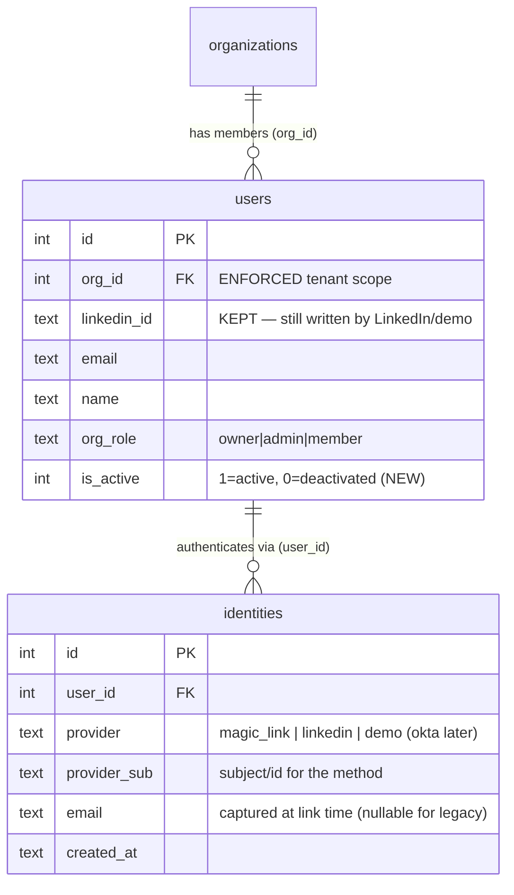
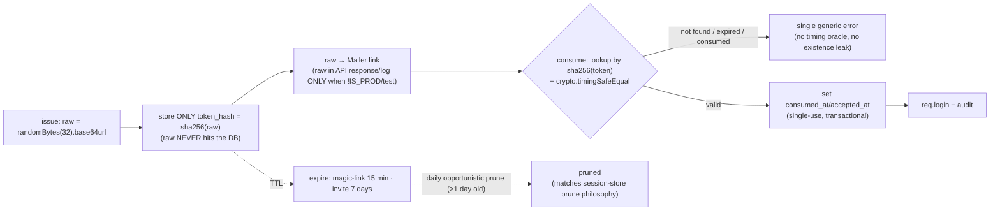
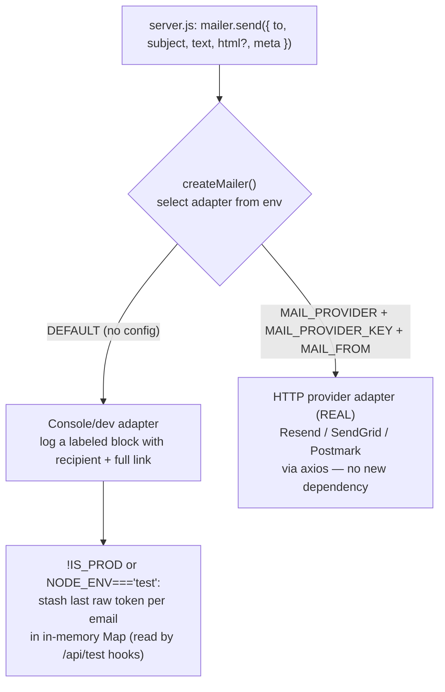

# Authentication — accounts, sign-in methods, identities, magic-link & invitations

[← Docs index](./README.md) · [Architecture](./architecture.md) · [Data model](./data-model.md) ·
[Multi-tenancy](./multi-tenancy.md) · [SaaS auth plan (Okta)](./saas-auth-okta.md)

> **Status: Phase 1 of [saas-auth-okta.md](./saas-auth-okta.md) — IN PROGRESS.** This doc describes
> authentication **as built after Phase 1**: real user accounts and team onboarding **without
> requiring LinkedIn or demo login**. It adds passwordless **email magic-link** auth, owner/admin
> **email invitations** (generalizing the org `join_code`), an **`identities`** table that decouples
> credential-from-person, per-user **deactivation** (`is_active`), a minimal **`audit_log`**, and a
> pluggable console-default **Mailer**. **Phase 2 (Okta SSO / BYO IdP) remains PLAN** — see the
> [Where Phase 2 plugs in](#where-phase-2-okta-sso-plugs-in) section.
>
> **Out of scope (unchanged from the plan):** Okta/SSO, `org_idp_config`/`org_domains`, SCIM/SAML,
> custom domains, billing, multi-org-per-user, password storage. No new runtime dependency — tokens
> use the already-imported `node:crypto`.

## Sign-in methods (after Phase 1)

A **person** is one `users` row in exactly one org. *How* they prove who they are is decoupled into
the **`identities`** table, so the same person can sign in via more than one method without forking
into two accounts (and so adding Okta in Phase 2 never orphans current users).

| Method | Provider | `provider_sub` | Notes |
| --- | --- | --- | --- |
| **Demo** | `demo` | literal `demo-user` (teammates keep `demo-teammate-*`) | Clearly-labeled evaluation login. **Unchanged.** |
| **LinkedIn OIDC** | `linkedin` | OIDC `sub` (today's `users.linkedin_id`) | Manual OAuth in routes; state check. **Unchanged.** |
| **Email magic-link** | `magic_link` | the canonical (lowercased, trimmed) email | **NEW.** No password stored; the verified email *is* the identity. |
| **Invitation accept** | (resolves to `magic_link`) | the invited email | **NEW.** Authenticates **and** assigns org + role in one step. |
| **Okta SSO** *(Phase 2)* | `okta` | Okta `sub` | **PLAN** — plugs into the same `identities` table. |

All methods converge on the **existing** `req.login(user)` (Passport session) and the **existing**
session cookie (`httpOnly`, `sameSite: 'lax'`, `secure: IS_PROD`) — Phase 1 changes *who can get a
session*, not *how the session works*.

## The identities model

Today a `users` row conflates "person" and "credential" (one `linkedin_id`). Phase 1 introduces
`identities` to split them, mirroring the plan's identity model:



- **Org isolation is implicit.** `identities` is keyed to a `user_id`, and a user has exactly one
  `org_id`; the org context always resolves *through the user*. There is no `org_id` on `identities`.
- **`UNIQUE (provider, provider_sub)`** — one identity per (method, subject). `idx_identities_user`
  speeds the user→identities lookup.
- **`users.linkedin_id` is KEPT, not dropped.** `upsertUser`, `findUserByLinkedInId`,
  `publicUser.isDemo`, and the `demo-teammate-%` head-count exclusions still read it. New writes
  populate **both** the `identities` row **and** (for LinkedIn/demo) `linkedin_id`.
- **Lookups become identity-first** via `findUserByIdentity(provider, provider_sub)` (joins to
  `users`); `upsertUser` is extended to *also ensure* a LinkedIn/demo identity row, so future logins
  resolve via `identities` while staying fully backward-compatible.

### Backfill (idempotent, at boot — a new "Backfill #N" block)

For every `users` row with **no** `identities` row, insert **exactly one** identity from
`linkedin_id`:

| `linkedin_id` value | Identity inserted |
| --- | --- |
| `'demo-user'` | `(demo, 'demo-user')` |
| `LIKE 'demo-teammate-%'` | `(demo, <linkedin_id>)` |
| `LIKE 'test-%'` (test DBs only) | `(linkedin, <linkedin_id>)` |
| any other non-null | `(linkedin, <linkedin_id>)` |
| `NULL` | **skip** — matched by email at magic-link time, gets a `magic_link` identity then |

So **no current login breaks**. The `is_active` column is added via the existing `ensureColumn`
helper and a backfill sets it to `1` everywhere (all current users active).

## Magic-link sign-in

Passwordless email magic-link is the **no-password fallback** for orgs without SSO. Tokens are
account-bound (not org-bound — the org resolves at consume time *via the user*) and stored only as
**hashes**.

```mermaid
sequenceDiagram
  actor U as User (browser)
  participant SPA as React SPA (login)
  participant API as Express (server.js)
  participant ML as Mailer (console default)
  participant DB as SQLite

  U->>SPA: Enter email, click "Email me a sign-in link"
  SPA->>API: POST /api/auth/magic-link/request { email }
  Note over API: rate-limited (5 / 15min by IP) + per-email cap (≤3 live)
  API->>API: canonicalize email (lowercase + trim)
  API->>API: raw = randomBytes(32).base64url
  API->>DB: INSERT magic_link_tokens (token_hash = sha256(raw), expires_at = now+15m)
  API->>DB: audit magic_link.issued (actor null, org null, target=email)
  API->>ML: send({ to, subject, text: link `${CLIENT_URL}/auth/magic?token=${raw}` })
  API-->>SPA: 200 { ok:true, devToken? }  %% devToken ONLY when !IS_PROD/test — NEVER prod
  Note over U,DB: ALWAYS 200 — no existence leak (known vs unknown email identical)

  U->>SPA: Click the emailed link → /auth/magic?token=…
  SPA->>API: POST /api/auth/magic-link/consume { token }
  API->>DB: SELECT by sha256(token); timingSafeEqual compare
  alt not found / expired / already consumed
    API-->>SPA: 400 { error } — single generic message for ALL failure modes
  else valid
    API->>DB: set consumed_at (single-use, transactional)
    API->>API: newUserResolution(email) → existing | invited | brand-new
    alt user.is_active = 0
      API-->>SPA: 403 { error:"This account has been deactivated." }
    else
      API->>DB: ensure magic_link identity row; audit magic_link.consumed + auth.login
      API->>API: req.login(user)  (session cookie)
      API-->>SPA: 200 { user }
    end
  end
```

### New-user resolution (consume / invite-accept)

When a magic-link is consumed (or an invite accepted) for an email, resolve in this **strict order**,
keeping onboarding identical to how a brand-new demo/LinkedIn user is handled today:

1. **Existing user** — match by a `magic_link` identity on that canonical email, else by
   `users.email` (case-insensitive). If found and `is_active=1`: ensure a `magic_link` identity row
   exists, `req.login`, done. If `is_active=0`: **403 deactivated**.
2. **Pending invitation** — if a live (unexpired, unaccepted) invitation exists for that email:
   create the user in **that invitation's org with the invited role**, create a `magic_link`
   identity, seed the impact row (`ensureImpactRow`), mark the invite accepted, log in. **Org/role
   come from the invitation ROW, never from request input.** (Checked on plain magic-link consume
   too, so an invited user who instead requests a magic link still lands in the right org.)
3. **Brand-new account** — create a `users` row **exactly as a new demo/LinkedIn user is created
   today**: assigned to `DEFAULT_ORG_ID` via the existing `setUserOrgIfNull` path, `org_role='member'`,
   a seeded `code_x_impact` row, and a `magic_link` identity. The user then sees the existing
   create-org / join-by-code onboarding (`inDefaultOrg` is true in `publicUser`). A new
   `upsertMagicLinkUser({ email })` helper encapsulates this, paralleling `upsertUser`.

**Email canonicalization (lowercase + trim)** is applied wherever a user is matched or created, so
the same person never forks into two accounts.

## Invitations

Generalizes the existing org `join_code`: an owner/admin invites a **specific email + role**, and the
invitee gets an emailed token that drops them into **THAT org with THAT role**. Accepting an invite
is the **org-routed twin of magic-link** — it authenticates *and* assigns org+role in one step.

```mermaid
sequenceDiagram
  actor A as Owner/Admin
  actor I as Invitee
  participant SPA as React SPA
  participant API as Express (server.js)
  participant ML as Mailer
  participant DB as SQLite

  A->>SPA: Invite teammate (email + role: admin|member)
  SPA->>API: POST /api/orgs/invitations { email, role }
  Note over API: requireAuth + requireOrgRole('owner','admin'); org_id = orgScope(req)
  API->>API: reject role='owner'; canonicalize email; raw = randomBytes(32)
  API->>DB: INSERT invitations (org_id, email, role, token_hash=sha256(raw), expires_at=now+7d)
  API->>DB: audit invite.created (target = email+role)
  API->>ML: send({ to, link `${CLIENT_URL}/invite?token=${raw}` })
  API-->>SPA: 201 { invitation:{ id,email,role,expiresAt }, devToken? }

  Note over I,DB: Later — invitee clicks the link (may be logged OUT)
  I->>SPA: /invite?token=…
  SPA->>API: POST /api/orgs/invitations/accept { token }   %% public — the invite IS the credential
  API->>DB: SELECT by sha256(token); timingSafeEqual
  alt invalid / expired / already accepted
    API-->>SPA: 400 { error } — one generic message
  else valid
    API->>API: resolve email → existing active user OR create user in invite's org+role
    alt existing user with connections/referrals joining a NEW org
      API-->>SPA: 409 — empty-account guard (mirrors /api/orgs/join)
    else deactivated
      API-->>SPA: 403 deactivated
    else ok
      API->>DB: set org_id + org_role from the ROW (setUserOrgRole); mark accepted_at (transactional)
      API->>DB: audit invite.accepted; req.login(user)
      API-->>SPA: 200 { user }
    end
  end
```

**Management endpoints** (all `requireOrgRole('owner','admin')`, all `org_id = orgScope(req)`):

- `GET /api/orgs/invitations` — list **this org's** pending invitations (the token is **never**
  returned).
- `DELETE /api/orgs/invitations/:id` — revoke a pending invite for **THIS org only** (404 if another
  org). Audit `invite.revoked`.
- Re-inviting the same email **supersedes** prior live invites for that org+email.
- **Owner cannot be invited** — ownership transfer is a separate role change; `role` must be
  `admin|member`.

## Token lifecycle & security

> **Auth is the crown jewels.** The same hardening applies to both magic-link and invitation tokens.



**Mandated security properties (the bar the Builder must meet):**

1. **Hash at rest only.** Tokens are stored solely as `sha256(raw)` hex in `token_hash`; the raw
   token **never** touches the DB.
2. **Constant-time compare.** Lookup is by `sha256(token)` then `crypto.timingSafeEqual` — no
   early-return timing oracle distinguishing valid-but-expired from unknown.
3. **Single-use, transactional.** `consumed_at` / `accepted_at` is set atomically; a second consume
   of the same token fails with the **same generic error** as an invalid one.
4. **Short-lived.** Magic-link **15 min**; invite **7 days**. Expired/consumed rows are pruned
   opportunistically (older than a day).
5. **Rate-limited issuance.** A dedicated `express-rate-limit` limiter (**5 req / 15 min by IP** —
   already imported, no new dep) mounted **only** on `/api/auth/magic-link/request`, plus a
   **per-email cap** (≤3 live unconsumed tokens; beyond that, silently still 200).
6. **No existence leak.** `magic-link/request` **always returns 200** with an identical body for
   known vs unknown emails. All consume/accept failure modes share **one** generic message.
7. **Dev/test-only raw token.** The raw token / full link is returned as `devToken` (or logged) **only
   when `!IS_PROD` or `NODE_ENV==='test'`** — **never** in production responses. In production the
   link goes solely to the Mailer.
8. **Tenant isolation holds.** `org_id` is from the **session** (`orgScope`) for authenticated routes
   and from the **invitation ROW** for accept — never from the body/params. A token/invite for org A
   can never act on org B.

### Test hooks (offline, `NODE_ENV==='test'` only)

Tests stay fully offline and never send real email. The console Mailer stashes the **last raw token
per email** into an in-memory `Map` (only in dev/test), exposed via:

- `GET /api/test/last-magic-link?email=…` → `{ token }`
- `GET /api/test/last-invite?email=…` → `{ token }` *(optional convenience)*

These mirror the existing `POST /api/test/login` hook. The existing test route is **unchanged**.

## Deactivation (`users.is_active`)

A new column `users.is_active INTEGER DEFAULT 1` (added via `ensureColumn`; backfill leaves all
current users active).

- **A deactivated user (`is_active=0`) CANNOT authenticate by ANY method** — magic-link consume,
  invite accept, demo login, LinkedIn callback, and the test login all check `is_active` right after
  resolving the user and **before** `req.login` → **403** `{ error:'This account has been
  deactivated.' }`.
- **Existing sessions are evicted on the next request.** `requireAuth` re-checks `req.user.is_active`
  every request, and `deserializeUser` re-reads the row, so flipping the flag is immediate.
- **Data is preserved.** Deactivation only flips the flag — connections, referrals, impact, and donor
  attribution rows are untouched, and the user still appears (flagged inactive) in member lists so
  fundraising history/attribution stays visible.
- **Endpoint:** `PATCH /api/orgs/members/:id/active { active:boolean }` — `requireOrgRole('owner','admin')`;
  target must be in `orgScope(req)` (404 otherwise). Admins can (de)activate members and other
  admins; only an **owner** can (de)activate an owner.
- **Sole-owner guard** (mirrors the existing sole-owner-cannot-be-demoted rule): if the target is the
  owner and `countOrgOwners(orgId).n <= 1` → **409** `{ error:'Assign another owner before
  deactivating this one.' }`. Reactivation has no such guard.
- Audit `user.deactivated` / `user.reactivated`. `orgMemberRows` is extended to `SELECT is_active` so
  the UI can render status.

## Audit log

A new **append-only, org-scoped** `audit_log` table — the "audit scaffold" Phase 1 calls for. There
is **no read endpoint in Phase 1** (a `GET /api/orgs/audit` owner/admin reader is a noted fast-follow).

A single `recordAudit({ orgId, actorUserId, action, target })` helper wraps a prepared insert in
`try/catch` so **an audit failure never breaks the operation**.

| `action` | `actor` / `org` | `target` (freeform; **never** a token/link/secret) |
| --- | --- | --- |
| `auth.login` | actor=user, org=user's | provider (`demo`/`linkedin`/`magic_link`) |
| `magic_link.issued` | actor **null**, org **null** | email — recorded for **all** requests incl. unknown emails (this row never reveals existence to a caller) |
| `magic_link.consumed` | actor=user | email |
| `invite.created` | actor=admin, org | `email + role` |
| `invite.accepted` | actor=user, org | email |
| `invite.revoked` | actor=admin, org | invite id / email |
| `role.changed` | actor=admin, org | `userId:old->new` |
| `user.deactivated` / `user.reactivated` | actor=admin, org | target user id |

**Raw tokens, link URLs, and secrets are NEVER written.** No PII beyond email.

## The Mailer (Adapter pattern, console default)

A pluggable Mailer abstraction in a **new `lib/mailer.js`**, mirroring the AI (no key) / GitHub (no
token) graceful-degradation philosophy and adding **no runtime dependency**.



- **Interface:** `mailer.send({ to, subject, text, html?, meta }) → Promise`. Factory
  `createMailer()` selects the adapter from env.
- **Console/dev adapter (DEFAULT, no config):** `console.log`s a clearly-labeled block with the
  recipient and full link. Runs in dev **and** in tests. Only when `!IS_PROD` or `NODE_ENV==='test'`
  it records the last raw token per email into the in-memory `Map` that the test hooks read — so
  tests retrieve the link offline.
- **HTTP provider adapter (REAL — now built):** set `MAIL_PROVIDER` (`resend` | `sendgrid` |
  `postmark`) + `MAIL_PROVIDER_KEY` + `MAIL_FROM` and `createMailer()` returns an adapter that sends
  via the provider's HTTP API using the already-present **axios — no new dependency**.
  `buildProviderRequest()` is a **pure** url+headers+body builder (unit-tested offline in
  `test/mailer.test.js`); the API key is never logged, and the adapter never exposes tokens
  (`lastTokenFor → null`). A *partial* config (e.g. provider without a key/from) falls back to console
  with a one-time warning, so a misconfiguration never silently drops mail or blocks dev login. (SMTP
  stays an intentional non-goal — it would add `nodemailer`.)
- **Templates** live in the module: `magicLinkEmail(link)` and `invitationEmail(orgName, role, link)`.
- **In production with no real adapter configured the console mailer still "works"** (logs), so login
  is never hard-broken; operators wire a real adapter via the seam.

`GET /api/auth/config` is extended with `{ magicLinkEnabled: true }` (always true, since the console
mailer is the default) so the SPA can show the email-link option alongside demo/LinkedIn.

## Where Phase 2 (Okta SSO) plugs in

Phase 1 is deliberately the foundation Phase 2 builds on (see [saas-auth-okta.md](./saas-auth-okta.md)):

- **`identities` already decouples credential-from-person**, so an `okta` provider is just another
  identity row keyed to the same user — current LinkedIn/demo/magic-link users are never orphaned.
- **`org_idp_config` + `org_domains`** (verified) and a **per-org OIDC strategy factory** are the
  Phase 2 additions; email → org routing resolves a domain to an org, then to its IdP config.
- **JIT provisioning** reuses `newUserResolution` (create-user-in-org), and **group → role mapping**
  reuses `setUserOrgRole`.
- **`is_active`** is the de-provisioning target for Phase 3 SCIM (offboarding in Okta disables here).
- The **`enforced` toggle** (Phase 2) can later disable magic-link/LinkedIn for an org once SSO is
  healthy — the Phase 1 methods stay the fallback until then.

## API contract (Phase 1)

All bodies JSON; auth-gated routes use the existing `requireAuth` / `requireOrgRole`.

**Public (no auth):**

| Endpoint | Request | Response |
| --- | --- | --- |
| `POST /api/auth/magic-link/request` | `{ email }` | `200 { ok:true, devToken? }` — **always 200**, no existence leak (`devToken` only `!IS_PROD`/test) |
| `POST /api/auth/magic-link/consume` | `{ token }` | `200 { user }`; `400 { error }` invalid/expired/used; `403 { error }` deactivated |
| `POST /api/orgs/invitations/accept` | `{ token }` | `200 { user }`; `400` invalid/expired/used; `403` deactivated; `409` non-empty account joining a new org |
| `GET /api/auth/config` *(extended)* | — | adds `{ magicLinkEnabled:true }` |

**Authenticated + owner/admin:**

| Endpoint | Request | Response |
| --- | --- | --- |
| `POST /api/orgs/invitations` | `{ email, role:'admin'\|'member' }` | `201 { invitation:{ id,email,role,expiresAt }, devToken? }`; `400` bad role/email |
| `GET /api/orgs/invitations` | — | `200 { invitations:[{ id,email,role,expiresAt,createdAt,invitedBy }] }` (this org only) |
| `DELETE /api/orgs/invitations/:id` | — | `200 { ok:true }`; `404` if not this org's |
| `PATCH /api/orgs/members/:id/active` | `{ active:boolean }` | `200 { members:[…] }` (refreshed, incl. `active`); `404` not-in-org; `409` sole-owner deactivation |

**Existing, unchanged:** `/api/auth/demo`, `/api/auth/linkedin` + `/callback`, `/api/auth/me`,
`/api/orgs`, `/api/orgs/join`, `/api/orgs/members`, `PATCH /api/orgs/members/:id` (role change —
extended only to write an audit row), `/api/orgs/join-code/rotate`, `/api/orgs/config`.

**Test-only (`NODE_ENV==='test'`):** existing `POST /api/test/login` **unchanged**; new
`GET /api/test/last-magic-link?email=` and (optional) `GET /api/test/last-invite?email=`.

## Recommended design patterns (Builder handoff)

These are *judicious* recommendations, consistent with the existing single-file Express / heavily
commented / prepared-statement style. **Reuse, don't duplicate.**

- **Mailer = Adapter / Strategy.** `createMailer()` is a factory selecting an adapter behind one
  `send(...)` interface — exactly the AI / GitHub graceful-degradation shape. The console adapter is
  the default; the SMTP/provider adapter is a documented seam. Lives in `lib/mailer.js` (the only new
  module).
- **A small `TokenService` seam for single-use tokens.** Centralize the four token operations —
  `issue()` (`randomBytes` → raw + `sha256` hash), `hash()`, `verify()` (lookup by hash +
  `timingSafeEqual`), and `consume()` (transactional single-use) — so magic-link and invitations
  share **one** hardened implementation rather than two copies. Even as a few helper functions in
  `server.js`, keeping the hash/expiry/constant-time/single-use logic in one place is the whole
  security bar in one auditable spot.
- **Reuse the org-scoping helpers — never re-derive `org_id`.** Authenticated routes use the existing
  `orgScope(req)` and `requireOrgRole(...)`; the accept route reads `org_id`/`role` from the
  **invitation row**. Do not add an `org_id` to `identities` or `magic_link_tokens` — org always
  resolves *through the user* (or the invitation row).
- **`newUserResolution` is the single onboarding funnel.** Magic-link consume and invite accept both
  route through it (existing → invited → brand-new). This is also where Phase 2 JIT provisioning will
  hook in, so keep it provider-agnostic.
- **Audit is fire-and-forget.** `recordAudit(...)` wraps its insert in `try/catch`; never let an
  audit write fail the operation, and never pass it a token/link/secret.
- **Email canonicalization in exactly one helper.** Lowercase + trim wherever a user is matched or
  created, so the same person never forks into two accounts.
- **Keep the existing logins byte-for-byte.** Demo, LinkedIn, `req.login`, `serialize/deserialize`,
  the session store, and `POST /api/test/login` are unchanged; Phase 1 only *adds* methods and the
  `is_active` gate.

See [data-model.md](./data-model.md) for the schema (the four new tables + `users.is_active`),
[multi-tenancy.md](./multi-tenancy.md) for the org-scoping convention these routes obey, and
[saas-auth-okta.md](./saas-auth-okta.md) for the full phased plan.
</content>
</invoke>
