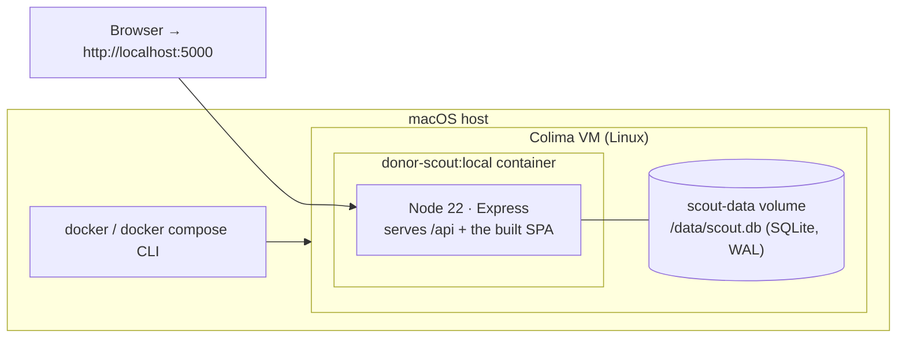

# Containerization (Docker + Colima)

Donor Scout ships as a single container image: the Express API and the built
React SPA served from one origin, with SQLite persisted on a mounted volume.
Containerizing now (while the app is becoming multi-tenant) gives every tenant
the same reproducible runtime and a clean path to a hosted SaaS deployment — see
[saas-auth-okta.md](./saas-auth-okta.md) for where this is headed.

> **Why Colima?** On macOS there's no native Docker daemon. **Colima** runs a
> lightweight Linux VM that provides one, and the standard `docker` / `docker compose`
> CLIs talk to it. It's the open-source, license-free alternative to Docker Desktop.

## Architecture



One image, two build stages (see [`Dockerfile`](../Dockerfile)):

| Stage | Does | Why it matters |
| --- | --- | --- |
| **build** | installs server prod deps (compiles the native `better-sqlite3` addon with python3/make/g++), installs client deps, runs `vite build` | `better-sqlite3` is a **native module** — it must be compiled inside the image for the image's platform, never copied from the host. `node_modules` is `.dockerignore`d to force this. |
| **runtime** | copies prod `node_modules`, `client/dist`, and the server code; runs as the non-root `node` user | small, hardened final image; toolchain left behind |

## One-time setup

```bash
# Install Colima + the Docker CLIs (Homebrew)
brew install colima docker docker-compose

# Start the Docker runtime. On Apple Silicon this runs an aarch64 VM by default;
# bump resources for comfortable image builds.
colima start --cpu 4 --memory 6

docker info        # should now succeed (daemon provided by Colima)
```

## Run it

```bash
cd /path/to/linkedin-donor-scout
docker compose up --build
# → open http://localhost:5000  →  "Continue in demo mode"
```

- The SPA + API are served on **http://localhost:5000** (single origin — the
  session cookie just works, no CORS).
- Data persists in the **`scout-data`** named volume (`/data/scout.db`). It
  survives `docker compose down`; use `docker compose down -v` to wipe it.
- AI / GitHub / LinkedIn stay disabled until you supply keys — the app degrades
  gracefully (demo mode works with nothing configured). Provide keys via a local
  `.env` (already git-ignored) or your shell; compose passes them through.

## Production vs. local (read this)

The session cookie's `Secure` flag is gated by `NODE_ENV=production`
(`server.js`, `secure: IS_PROD`). A `Secure` cookie is **only sent over HTTPS**,
so:

| Context | `NODE_ENV` | Why |
| --- | --- | --- |
| Local Colima over `http://localhost` | `development` (compose default) | a Secure cookie over plain HTTP would silently break login |
| Real deployment | `production` | behind TLS / a reverse proxy; Secure cookies are correct |

The **image** defaults to `production`; `docker-compose.yml` overrides it to
`development` for local HTTP. For a production run, put the container behind a
TLS-terminating proxy (or platform load balancer) and set `NODE_ENV=production`
+ a strong `SESSION_SECRET`.

## Verify the image (when Colima is running)

```bash
docker build -t donor-scout:local .          # build only
docker run --rm -e NODE_ENV=development -p 5000:5000 \
  -v scout-data:/data donor-scout:local      # run without compose
curl -s localhost:5000/api/auth/config        # → {"linkedinEnabled":false,...}
```

> **Note:** the image in this repo has not yet been built on this machine
> (Colima/Docker were not installed when it was authored). The `Dockerfile` is
> written for this stack (native `better-sqlite3` build, single-origin SPA serve,
> volume-backed SQLite); run the commands above to build and confirm locally.

## Health checks (liveness probe)

The image and `docker-compose.yml` both declare a `HEALTHCHECK` that hits
**`GET /healthz`** — the app's liveness endpoint (no auth, no DB; see
[observability](#observability) below). It uses node's built-in `http` client
(via `node -e`) rather than `curl`/`wget`, so nothing extra has to be installed
into the slim runtime image:

```
HEALTHCHECK --interval=30s --timeout=3s --start-period=10s --retries=3 \
  CMD node -e "require('http').get('http://127.0.0.1:'+(process.env.PORT||5000)+'/healthz', \
      r=>process.exit(r.statusCode===200?0:1)).on('error',()=>process.exit(1))"
```

`docker compose ps` then shows a `healthy`/`unhealthy` column, and an
orchestrator (ECS/Fly/Render/Kubernetes) restarts a container that stops
answering. Behind a load balancer, wire the **LB liveness probe to `/healthz`**
and the **readiness/target-group health to `/readyz`** (the latter runs a trivial
`SELECT 1` to confirm the DB is reachable before the instance takes traffic).

## Observability

Two unauthenticated probe endpoints and a structured request log live in
`server.js`, mounted before auth/rate-limit/session so they're cheap and never
caught by the SPA catch-all:

- **`GET /healthz`** — liveness. No DB. `200 {status:'ok', uptime, timestamp}`.
- **`GET /readyz`** — readiness. Runs `SELECT 1`. `200 {status:'ready'}` or
  `503 {status:'not_ready'}`. Never leaks the underlying error.
- **Structured request logging** — one JSON line per request
  (`method`/`path`/`status`/`durationMs`/request `id`) via `console`, no new
  dependency. It logs **no** bodies, headers, cookies, query strings, tokens, or
  PII. Off under `NODE_ENV=test`; otherwise on, and gated by `LOG_REQUESTS`
  (`LOG_REQUESTS=0` to silence, `=1` to force on). The `/healthz` and `/readyz`
  probes are skipped at info level to avoid probe spam.

## Common issues

- **`docker` works but `docker compose` doesn't** — install `docker-compose`
  (Colima doesn't bundle the Compose plugin): `brew install docker-compose`.
- **Login fails in the browser** — you're likely running with
  `NODE_ENV=production` over HTTP; use the compose default (`development`) for
  local, or serve over HTTPS.
- **Slow first build** — compiling `better-sqlite3` + the Vite build takes a
  minute; subsequent builds are layer-cached.
- **Native module errors at boot** — almost always means `node_modules` leaked
  from the host into the image; confirm it's listed in `.dockerignore`.
