# Data model

[← Docs index](./README.md) · [Architecture](./architecture.md) · [AI engine](./ai-engine.md) ·
[Authentication](./auth.md)

All persistence is **SQLite** via `better-sqlite3` (synchronous, prepared statements), one file at
`data/scout.db` in WAL mode. Tables are created with `CREATE TABLE IF NOT EXISTS` at boot;
`ensureColumn()` performs lightweight additive migrations for databases created before a column
existed. Sessions live in a `sessions` table managed by `better-sqlite3-session-store`.

## ER diagram

```mermaid
erDiagram
  users ||--o{ connections : "owns (user_id)"
  users ||--o{ referrals : "owns (user_id)"
  users ||--|| code_x_impact : "has (user_id UNIQUE)"
  users ||--o{ contact_history : "owns (user_id)"
  users ||--|| voice_profiles : "has (user_id PK)"
  users }o--o{ teams : "via team_members"
  connections ||--o{ referrals : "referenced (connection_id)"
  referrals ||--o{ follow_up_reminders : "cadence steps (referral_id)"
  organizations ||--o{ follow_up_reminders : "org_id (denormalized scope)"
  connections ||--o{ contact_history : "matched (connection_id, nullable)"
  organizations ||--|| org_config : "has (org_id PK)"
  organizations ||--o{ users : "org_id (ENFORCED scope)"
  organizations ||--o{ connections : "org_id"
  organizations ||--o{ referrals : "org_id"
  organizations ||--o{ teams : "org_id"
  organizations ||--o{ code_x_impact : "org_id"
  organizations ||--o{ contact_history : "org_id"
  organizations ||--o{ voice_profiles : "org_id"
  organizations ||--o{ invitations : "org_id (inviting org)"
  organizations ||--o{ audit_log : "org_id (org context, nullable)"
  organizations ||--o| org_idp_config : "configures SSO (org_id PK)"
  organizations ||--o{ org_domains : "verifies (org_id)"
  users ||--o{ identities : "authenticates via (user_id)"

  users {
    int id PK
    text linkedin_id "UNIQUE; 'demo-user' for demo; KEPT post-Phase-1"
    text email
    text name
    text profile_picture
    text company "scout's own — drives coworker scoring"
    text past_companies
    text location
    text schools
    real goal_amount
    int team_id "active team"
    int demo_mode
    int org_id "ENFORCED tenant scope (FK organizations)"
    text org_role "owner|admin|member (default member)"
    int is_active "1=active, 0=deactivated (blocks all auth; default 1)"
    text strategy "selected strategy key; NULL→org default→relationship_first"
    text strategy_weights "JSON {affinity,propensity,capacity} for custom_weights"
    text created_at
  }
  identities {
    int id PK
    int user_id FK "owning person (org resolves THROUGH the user)"
    text provider "magic_link | linkedin | demo | okta"
    text provider_sub "subject/id: linkedin sub | 'demo-user' | canonical email"
    text email "captured at link time (nullable for legacy)"
    text created_at "UNIQUE(provider, provider_sub)"
  }
  magic_link_tokens {
    int id PK
    text email "canonical lowercased email (account-bound, not org-bound)"
    text token_hash "sha256(rawToken) hex — raw NEVER stored"
    text expires_at "now + 15 min"
    text consumed_at "set on single-use consumption (nullable)"
    text created_at
  }
  invitations {
    int id PK
    int org_id "inviting org — isolation invariant; role/org read from THIS row"
    text email "canonical lowercased"
    text role "admin | member (NOT owner)"
    text token_hash "sha256(raw) — raw NEVER stored"
    int invited_by "actor user_id"
    text expires_at "now + 7 days"
    text accepted_at "single-use (nullable)"
    text created_at
  }
  audit_log {
    int id PK "append-only"
    int org_id "org context (nullable for pre-org events)"
    int actor_user_id "who (null for unauthenticated, e.g. magic-link request)"
    text action "dotted verb (auth.login, magic_link.issued, invite.created, sso.*, …)"
    text target "freeform: email / user id / role — NO raw tokens, NO secrets"
    text created_at
  }
  org_idp_config {
    int org_id PK "at most one IdP config per org (FK organizations)"
    text type "'okta_oidc'"
    text issuer "Okta issuer URL (OIDC discovery base)"
    text client_id
    text client_secret_enc "AES-256-GCM ciphertext — raw secret NEVER stored/returned"
    text group_role_map "JSON: { OktaGroup: 'owner|admin|member' }"
    int jit_provisioning "1 → first SSO login creates the user"
    int enforced "1 → disable non-SSO logins for this org's members"
    text created_at
    text updated_at
  }
  org_domains {
    int id PK
    int org_id "owning org — isolation invariant (FK organizations)"
    text domain "canonical lowercased, e.g. acme.org — UNIQUE globally (anti-takeover)"
    int verified "1 → may route SSO / claim users (default 0)"
    text verify_token "opaque DNS-TXT/email token (the actual check is stubbed for now)"
    text created_at
  }
  connections {
    int id PK
    int user_id FK
    text contact_name
    text contact_email
    text company
    text role
    text location
    text linkedin_url
    text github_username
    int github_followers
    int github_repos
    text github_confidence "confirmed|high|medium|low"
    text github_bio
    int donor_likelihood_score "the RANK = strategy.combine(components)"
    int affinity_score "component: who the scout knows"
    int propensity_score "component: cause fit (scaled 0–100)"
    text company_tier
    int capacity_score "component: ask-sizing; display, not the default rank"
    text score_reasons "JSON array of reason tags"
    text dossier_json "cached AI dossier (JSON)"
    text dossier_at "when generated"
    int is_demo
    int org_id
    text created_at
  }
  referrals {
    int id PK
    int user_id FK
    int connection_id FK
    text contact_name
    text contact_email
    text company
    text linkedin_url
    text status "to_ask|asked|following_up|donated|declined"
    text note
    text follow_up_date "VIEW onto next open reminder's due_date"
    int donation_received
    real donation_amount
    text donation_date
    int org_id
    text referred_at
  }
  follow_up_reminders {
    int id PK
    int referral_id FK
    int user_id "denormalized for org-scoped queries"
    int org_id "denormalized for org-scoped queries"
    int step_index "0,1,2,… in the cadence"
    text due_date "YYYY-MM-DD"
    text done_at "NULL = open; set = completed/closed"
    text closed_reason "completed|donated|declined|NULL"
    text created_at
  }
  code_x_impact {
    int id PK
    int user_id FK "UNIQUE"
    real total_referred_donations
    int num_referrals_converted
    int num_students_supported
    int num_days_funded
    int org_id
    text last_updated_at
  }
  teams {
    int id PK
    text name
    text invite_code "UNIQUE (team join)"
    real goal_amount
    int created_by
    int org_id "team belongs to creator's org; join rejects cross-org"
    text created_at
  }
  team_members {
    int team_id PK
    int user_id PK
    text role "owner|member"
    text joined_at
  }
  contact_history {
    int id PK
    int user_id FK
    int org_id
    int connection_id FK "nullable — matched by normalized name"
    text match_name
    text last_interaction
    int message_count
    int sent_count
    int received_count
    text snippets "JSON: [{date,direction,text}] (≤3)"
    text source "'messages'"
    text updated_at
  }
  voice_profiles {
    int user_id PK
    int org_id
    text sample "scout's own past sent messages (≤8000 chars)"
    text updated_at
  }
  organizations {
    int id PK
    text name
    text slug "UNIQUE ('default')"
    text join_code "UNIQUE — org invite (distinct from team invite_code)"
    int created_by "promoted to owner"
    text created_at
  }
  org_config {
    int org_id PK
    text config_json "cause economics + affinity keywords + defaultStrategy"
    text updated_at
  }
  ai_usage {
    int id PK "CHECK (id = 1) — single row"
    int window_start
    real usd_spent
  }
```

> Foreign keys are declared on `connections`/`referrals`/`code_x_impact` → `users` and on
> `identities.user_id` → `users`. `org_id` is a plain column on the org-owned tables (and on
> `invitations`/`audit_log`). `magic_link_tokens` is account-bound (keyed by email, no `org_id`); its
> org resolves *through the user* at consume time. The `sessions` table (express-session store) is
> omitted from the diagram.

## Table notes

- **`users`** — one row per scout. `req.user` is this full row, now including `org_id` (the enforced
  tenant scope), `org_role` (owner/admin/member), and the per-user strategy choice
  (`strategy` + `strategy_weights`). The scout's own `company`, `past_companies`, `location`,
  `schools` feed relationship scoring; editing them re-ranks connections.
  `linkedin_id = 'demo-user'` marks the demo account. A user belongs to **exactly one** org.
- **`connections`** — the imported LinkedIn network, scored per scout. The scorer now persists the
  three **component sub-scores** — `affinity_score`, `propensity_score`, `capacity_score` — and
  `donor_likelihood_score` is the **strategy-combined final rank** (relationship_first, the default,
  reproduces the old relationship-led rank exactly). Capacity remains display / ask-sizing
  regardless of strategy. `score_reasons` is a JSON array of human-readable tags.
  `dossier_json`/`dossier_at` cache the AI dossier (added by `ensureColumn`). `withReasons()` parses
  `score_reasons` and `dossier_json` for the API payload (its shape is unchanged). See
  [fundraising-strategies.md](./fundraising-strategies.md).
- **`referrals`** — the outreach pipeline; one row per asked connection, with `status`, a
  `follow_up_date`, and donation fields. Conversions drive `code_x_impact`. `follow_up_date` is now a
  **view onto the cadence** — kept in sync with the next open reminder's `due_date` by the reminder
  helpers (the column is never written from request input). See the outreach note below.
- **`follow_up_reminders`** — the outreach **cadence**: an ordered sequence of scheduled follow-up
  steps per referral. One row per step (`step_index` 0,1,2,…) with a `due_date` and an open/closed
  state (`done_at` NULL → open). Org-scoped via the parent referral's `(user_id, org_id)`, denormalized
  onto each row so every reminder query scopes the same way as the rest of the schema (a cross-org
  reminder/referral id therefore reads no row → routes 404). Marking a referral **asked** seeds step 0
  (`+cadence[0]` days out); **completing** a step marks it done and seeds the next step (anchored on the
  completed step's `due_date`, not "today", so the schedule stays even when worked late); **snooze** just
  moves `due_date` without advancing; **donated/declined** closes all open reminders. The cadence is
  configurable per org via `org_config.followUpCadenceDays` (array of positive day-offsets; default
  `[3, 7, 14]` → +3d/+1w/+2w), validated by `resolveCadence()` with a fallback to the default.
- **`code_x_impact`** — per-user aggregate (`recomputeImpact()`); concrete impact units derived from
  `cause.config.js` economics (`programCost`, `dayCost`).
- **`teams` / `team_members`** — many-to-many membership (a user has one *active* `team_id` plus
  membership rows). A team belongs to one org (`teams.org_id`). The leaderboard (`teamPayload()`) shows
  **real** members with their **real** live stats (`code_x_impact` joined org-scoped on `(user_id, org_id)`;
  team referral counts also org-scoped), ordered by raised → donations → name. Team goal/impact figures are
  driven by **per-org** economics (`getOrgConfig(team.org_id)` → `programCost`/`dayCost`), not the
  module-level `COST_PER_*` constants — consistent with `/api/impact`. The seeded **`demo-teammate-*`**
  users are confined to **demo mode** (`POST /api/demo/enable` seeds them onto the active team;
  `/api/demo/disable` removes them) — they never appear on a real team's leaderboard.
- **`contact_history`** ⭐ — per-contact relationship memory distilled from the LinkedIn full export
  (messages): counts (`message_count`/`sent_count`/`received_count`), `last_interaction`, and up to
  3 `snippets`. Matched to a `connection_id` by normalized name (nullable when unmatched). Written by
  `POST /api/history/upload`; read by `historyForConnection.all(user_id, connection_id)`.
  **Currently consumed only by the Dossier** — the planned AI Outreach Drafts feature is its second
  consumer.
- **`voice_profiles`** ⭐ — one row per user: `sample` = the scout's **own past sent messages**
  (capped at 8000 chars), captured from their LinkedIn export. **Captured but currently consumed by
  NOTHING** — it exists precisely to make AI drafts sound like the scout (see
  [ai-outreach-drafts.md](./ai-outreach-drafts.md)).
- **`organizations` / `org_config`** — the multi-tenancy tables, now **enforced**. A `default` org is
  seeded from `cause.config.js`; `organizations.join_code` is the org invite code (distinct from team
  `invite_code`); `created_by` is promoted to `owner`. `org_config.config_json` holds the per-org
  cause economics + affinity keywords + **`defaultStrategy`**, read by `orgConfigForUserId()`
  (scoring now reads this instead of the module-level `CAUSE` constants). See
  [multi-tenancy.md](./multi-tenancy.md).
- **`ai_usage`** — single-row store (`CHECK (id = 1)`) for the rolling AI dollar budget, so spend
  survives restarts (see [ai-engine.md](./ai-engine.md)).
- **`identities`** ⭐ (Phase 1) — decouples **credential from person**, so one user can sign in via
  more than one method without forking accounts and adding Okta later never orphans current users.
  Keyed to `user_id`; **org isolation is implicit** (a user has one `org_id`, resolved *through* the
  user — there is no `org_id` on this table). `UNIQUE(provider, provider_sub)`,
  `idx_identities_user`. `provider_sub` semantics: `linkedin` → OIDC `sub` (today's `linkedin_id`);
  `demo` → literal `demo-user` (teammates keep `demo-teammate-*`); `magic_link` → the canonical
  (lowercased, trimmed) email. `users.linkedin_id` is **kept** — LinkedIn/demo still write both it
  and an identity row; lookups are identity-first via `findUserByIdentity(provider, provider_sub)`.
  See [auth.md](./auth.md).
- **`magic_link_tokens`** ⭐ (Phase 1) — passwordless sign-in tokens; **account-bound, not org-bound**
  (the org resolves at consume time via the user). Stored **only as a hash** (`token_hash =
  sha256(raw)`); the raw token never hits the DB. 15-minute expiry, single-use (`consumed_at`),
  constant-time lookup (`crypto.timingSafeEqual`) keyed by `idx_mlt_hash`. Pruned opportunistically
  (rows older than a day). See the token lifecycle in [auth.md](./auth.md#token-lifecycle--security).
- **`invitations`** ⭐ (Phase 1) — generalizes `organizations.join_code`: owner/admin invites a
  specific `email` + `role` into a specific `org_id`. **`org_id` and `role` are read from THIS row**
  on accept, never from request input, so an invite for org A can never act on org B. Token stored as
  a hash; 7-day expiry; single-use (`accepted_at`). `idx_inv_hash`, `idx_inv_org_email`. Role is
  `admin|member` only (owner is never invitable). See [auth.md](./auth.md#invitations).
- **`audit_log`** ⭐ (Phase 1) — **append-only, org-scoped** scaffold. `recordAudit({orgId,
  actorUserId, action, target})` (insert wrapped in `try/catch` so it never breaks the operation)
  writes `auth.login`, `magic_link.issued`/`consumed`, `invite.created`/`accepted`/`revoked`,
  `role.changed`, `user.deactivated`/`reactivated`, and (Phase 2) `sso.config_updated`/`config_removed`,
  `sso.domain_added`/`verified`/`removed`, `sso.start`, `sso.provisioned`, `auth.sso_failed`. **Never
  stores raw tokens, links, or secrets**; no PII beyond email. `idx_audit_org`. Read via the
  owner/admin `GET /api/orgs/audit` reader.
- **`org_idp_config`** ⭐ (Phase 2) — per-org Okta OIDC config (BYO IdP). PK is `org_id`, so an org has
  **at most one** IdP config. `client_secret_enc` is **AES-256-GCM ciphertext** (app-level encryption,
  `lib/secrets.js`, key from `SECRETS_KEY` — dev-key fallback with a warning in non-prod); the raw
  secret is **never stored and never returned** by any API (`publicIdpConfig()` exposes only
  `hasClientSecret`). `group_role_map` is JSON mapping an Okta group claim → `owner|admin|member`;
  `jit_provisioning` and `enforced` are 0/1 toggles. See [saas-auth-okta.md](./saas-auth-okta.md).
- **`org_domains`** ⭐ (Phase 2) — verified email domains that route a user's email → org → IdP config.
  `domain` is **globally `UNIQUE`** so it resolves to exactly one tenant (an Okta token's email domain
  can map to only one org). A domain starts `verified=0` and **only a verified domain routes SSO or
  claims users** (anti-takeover); `verify_token` backs a DNS-TXT/email check that is **stubbed for
  now** (the gate + token exist; a real deploy performs the check before flipping `verified`).
  `idx_org_domains_org`. See [saas-auth-okta.md](./saas-auth-okta.md).

## Privacy

`POST /api/history/upload` is idempotent (it deletes the user's prior `contact_history` then
re-inserts) and `DELETE /api/history` wipes **both** `contact_history` and `voice_profiles` for the
user — the "delete my data" promise. Any feature that reads these tables must not persist new copies
of that data elsewhere, or it would break that promise.

## Multi-tenancy status — ENFORCED this round

`org_id` exists on `users`, `connections`, `referrals`, `teams`, `code_x_impact`, `contact_history`,
`voice_profiles` and is backfilled to the default org. This round, **every data query additionally
filters by the caller's `org_id`** (derived from the session, never from input), roles
(`users.org_role`) gate admin endpoints, and org create/join onboarding lands. The full design —
including the **data-isolation convention the Builder must apply to every statement** — is in
[multi-tenancy.md](./multi-tenancy.md).

## Migrations & backfill (boot, idempotent)

New additive columns via `ensureColumn`: `users.org_role` (`TEXT DEFAULT 'member'`),
`users.strategy` (`TEXT`), `users.strategy_weights` (`TEXT`), `organizations.join_code`
(`TEXT UNIQUE`), `connections.affinity_score`/`propensity_score` (`INTEGER DEFAULT 0`), and **Phase
1** `users.is_active` (`INTEGER DEFAULT 1`). The existing backfill loop is extended to stamp `org_id`
from each row's owning user on `contact_history`/`voice_profiles`, set `org_role='member'` where
NULL, promote one owner per org (`organizations.created_by` else `MIN(users.id)`), and generate
`join_code` where NULL. Bumping `SCORING_VERSION` (shipped as `v5-component-subscores`) populates the
component columns and recomputes ranks for everyone on first boot via the existing `app_meta`
machinery.

**Phase 1 (accounts/auth) migrations (idempotent, re-runnable "Backfill #N" blocks):**
- The four new tables (`identities`, `magic_link_tokens`, `invitations`, `audit_log`) are added to
  the `CREATE TABLE IF NOT EXISTS` block with their indexes.
- `users.is_active` added via `ensureColumn`; a backfill sets `is_active=1` where NULL (all current
  users active).
- **Identities backfill:** for every `users` row with **no** `identities` row, insert exactly **one**
  identity from `linkedin_id` — `'demo-user'`→`(demo,'demo-user')`; `LIKE 'demo-teammate-%'`→
  `(demo,<linkedin_id>)`; `LIKE 'test-%'` (test DBs)→`(linkedin,<linkedin_id>)`; any other non-null→
  `(linkedin,<linkedin_id>)`; `NULL`→**skip** (matched by email at magic-link time). So **no current
  login breaks**. See [auth.md](./auth.md#backfill-idempotent-at-boot--a-new-backfill-n-block).

**Outreach cadence migration (Backfill #8, idempotent):** the new `follow_up_reminders` table is added
to the `CREATE TABLE IF NOT EXISTS` block (with `idx_reminders_queue`/`idx_reminders_referral`). A
backfill migrates the **old single `follow_up_date`** into the new model: for every still-**open**
referral (not donated/declined) that has a non-empty `follow_up_date` **and no reminder yet**, it
inserts a step-0 reminder at that date. The `NOT EXISTS` guard makes it re-runnable, and referrals
without a date stay un-seeded (they get a cadence the next time they're marked **asked**). So referrals
that already had a follow-up date keep nagging at exactly that date — now as the first cadence step.

> **Implementation status (Pass 1 of 2).** This round shipped: all the columns above, full org
> scoping/roles/onboarding, the persisted `affinity_score`/`propensity_score` component sub-scores,
> per-org cause config driving the scorer, and the **org-level** default strategy
> (`org_config.defaultStrategy`, editable by owner/admin, resolved by `strategyForUser(user)`).
> The **per-user selectable strategy** (`users.strategy`/`strategy_weights`, the `STRATEGIES`
> registry combiner, `GET /api/strategies`, `POST /api/profile/strategy`, the ProfilePage picker)
> is **Pass 2** — the columns exist and resolve to the org default, and `donor_likelihood_score`
> remains exactly today's relationship-first output until that layer lands.
</content>

## Trust & privacy: data portability, erasure, audit read

Three privacy-baseline endpoints round out the trust story. All three reuse the existing
isolation primitives (`orgScope(req)`, `requireOrgRole`, the sole-owner guard pattern,
`recordAudit`) — they introduce no new tables.

- **`GET /api/account/export` (data portability / GDPR access).** Returns the **caller's own**
  data as a downloadable JSON document (`Content-Disposition: attachment`): profile, their
  connections (including `dossier_json`), referrals, impact, `contact_history`, voice-profile
  presence + the small inline sample, `identities` (provider **names + dates only** — never the
  `provider_sub`/secret), and team memberships. Strictly scoped to `(req.user.id, orgScope(req))`,
  so it can never reach another user's or another org's rows. The export is audited
  (`account.exported`).

- **`DELETE /api/account` (right to erasure).** Genuine **hard delete** of the caller's own
  account and all per-user data — `connections`, `referrals`, `code_x_impact`, `contact_history`,
  `voice_profiles`, `identities`, `team_members`, and the `users` row — in a single transaction.
  Distinct from the `is_active=0` deactivation (which preserves data + donor attribution and
  stays). Requires an explicit `confirm` field. **Safeguard (mirrors the sole-owner-cannot-be-
  demoted/deactivated guards):** a user who is the **sole owner of an org that still has other
  members** is blocked with **409** ("transfer ownership first"); a **last-member owner** may
  delete, and the now-empty non-default org + its `org_config` are cleaned up. Empty teams the
  user owned (and any demo teammates seeded under them) are removed too. The deletion is audited
  (`account.deleted`) **before** the row is gone (the append-only `audit_log` outlives the actor),
  and the session is destroyed afterward.

- **`GET /api/orgs/audit` (operator transparency).** Owner/admin only, org-scoped, paginated
  (`limit`/`offset`, default 50, max 200), **newest-first**. Returns the org's `audit_log` entries
  (`action`, `target`, `actor_user_id`, `created_at`). By construction the table holds **no tokens
  or secrets** — only dotted verbs + a freeform target — so nothing privileged leaks. Surfaced as
  a collapsible Audit-log view in OrgSettings; Export/Delete live in a Privacy/Danger-zone section
  on the Profile page.
