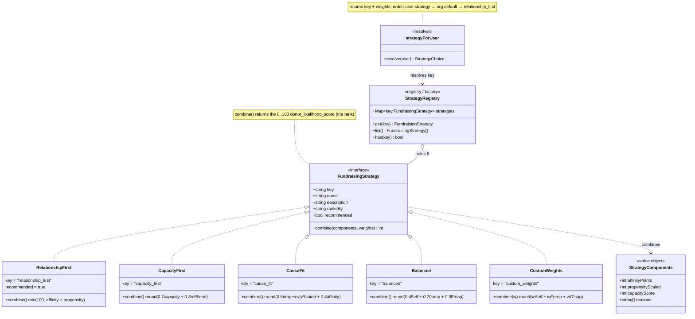
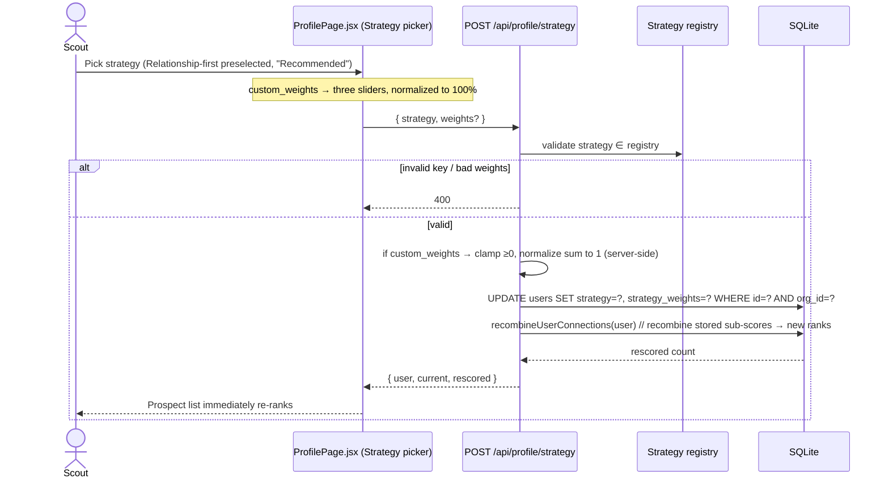

# Fundraising strategies — a pluggable ranking abstraction

[← Docs index](./README.md) · [Architecture](./architecture.md) · [Data model](./data-model.md) ·
[Multi-tenancy](./multi-tenancy.md)

> **Status:** approved by the PM; built **after** real multi-tenancy lands. Today `scoreProspect`
> hardcodes a relationship-led rank. This doc designs a small **Strategy pattern** so a scout can
> rank prospects differently — while keeping **Relationship-first** the default and the product's
> evidence-based thesis intact.

## The core idea — separate components from combination

The scorer already computes three independent signals. The refactor makes them **first-class,
persisted component sub-scores**, and lets a chosen **strategy** decide how to combine them into the
final `donor_likelihood_score` (the rank):

- **Affinity** — who the scout actually knows (shared surname/family, shared school,
  current/former coworker, reachable-by-email, same city). From `affinitySignals(contact, scout)`.
- **Propensity** — alignment with the cause (a personal tie via `org_config.affinity` keywords;
  broader cause-aligned signals via `org_config.causeAlignment`). From `propensitySignals(contact)`.
- **Capacity** — estimated giving capacity (company tier + GitHub footprint + role seniority).
  Already computed; remains a **display / ask-sizing** signal regardless of strategy.

`scoreProspect` is refactored into a **pure component scorer** returning
`{ affinityPoints, propensityScaled, capacityScore, reasons }` (where `propensityScaled` lifts the
intentionally-low propensity cap into a 0–100 range). The signal readers now use
`orgConfigForUserId(user.id)` instead of the module-level `CAUSE` constants, so **per-org cause
config drives scoring**. A strategy then combines the components.

Persisted on each `connections` row: `affinity_score`, `propensity_score` (new columns),
`capacity_score` (existing), and `donor_likelihood_score` (the strategy-combined final rank).
Because the components are stored, **switching strategy recombines without recomputing signals**.

## The Strategy pattern



### Interface signature (handed to the Builder)

Keep it a **plain object registry**, not a class hierarchy — match the single-file, function-first
style of `server.js`. Each strategy is a value object with a pure `combine`:

```js
// One entry per strategy in a module-level STRATEGIES registry.
{
  key: 'relationship_first',
  name: 'Relationship-first (default)',
  description: '…',
  ranksBy: '…',                 // human-readable, surfaced in GET /api/strategies
  recommended: true,            // only relationship_first
  // Pure: components → final rank. weights only used by custom_weights.
  combine: ({ affinityPoints, propensityScaled, capacityScore }, weights) =>
    Math.min(100, affinityPoints + propensityScaled),
}
```

**Registry / factory** (the convention):

```js
const STRATEGIES = { relationship_first, capacity_first, cause_fit, balanced, custom_weights };
const DEFAULT_STRATEGY = 'relationship_first';

function getStrategy(key) { return STRATEGIES[key] || STRATEGIES[DEFAULT_STRATEGY]; }

// Resolution order: user's explicit choice → org default → relationship_first.
function strategyForUser(user) {
  const orgDefault = orgConfigForUserId(user.id)?.defaultStrategy;
  const key = (user.strategy && STRATEGIES[user.strategy]) ? user.strategy
            : (orgDefault && STRATEGIES[orgDefault]) ? orgDefault
            : DEFAULT_STRATEGY;
  const weights = key === 'custom_weights'
    ? normalizeWeights(safeParse(user.strategy_weights, null)) // sums to 1, clamped ≥0
    : null;
  return { key, weights };
}

// combine at score time:
function combineScore(components, user) {
  const { key, weights } = strategyForUser(user);
  return getStrategy(key).combine(components, weights);
}
```

`strategyForUser` mirrors `orgConfigForUserId` — the same "resolve per-user, fall back to org, then a
safe default" convention.

## The shipping strategies

| key | name | ranksBy |
| --- | --- | --- |
| `relationship_first` | **Relationship-first** (default, **Recommended**) | `min(100, affinityPoints + propensityScaled)` — capacity is display/ask-sizing + final tiebreaker only. **Reproduces today's `scoreProspect` output exactly**, so existing rankings are unchanged. |
| `capacity_first` | Capacity-first | `min(100, round(0.7*capacityScore + 0.3*relationshipBlend))`, `relationshipBlend = (affinityPoints + propensityScaled)` normalized to 100; affinity is the tiebreaker. Surfaced with an in-app caution. |
| `cause_fit` | Cause-fit / Propensity-first | `min(100, round(0.6*propensityScaled + 0.4*affinityPoints))`; capacity tiebreaker. |
| `balanced` | Balanced blend | `min(100, round(0.45*affinityPoints + 0.20*propensityScaled + 0.35*capacityScore))`. |
| `custom_weights` | Custom weights | `min(100, round(wA*affinityPoints + wP*propensityScaled + wC*capacityScore))`, `wA+wP+wC=1` from `users.strategy_weights`. Defaults `{1,0,0}` (≈ relationship_first) until edited. |

> **Note — `cause_fit` (and any strategy that weights propensity) is sensitive to per-org config.**
> `propensityScaled` lifts the propensity component onto a 0–100 scale by dividing by
> `propensityMax = org_config.affinity.weight + org_config.causeAlignment.weight` (default ≈ 32). Because
> that ceiling is low, contacts with strong cause ties can saturate near 100 under `cause_fit`, compressing
> the distinction *among* several strongly-cause-aligned prospects (capacity then breaks the tie). An org
> that widens its affinity/alignment weights changes how finely `cause_fit` differentiates. This is expected;
> tune the per-org weights if you need more separation at the top of a cause-led list.

## Strategy selection, persistence & re-scoring

**Scope:** per-user choice with an org-level default. New users inherit
`org_config.config_json.defaultStrategy` (itself defaulting to `relationship_first`); a user may
override for themselves on `ProfilePage`.

**Persistence:**
- `users.strategy` (`TEXT`, NULL → resolves to org default → `relationship_first`).
- `users.strategy_weights` (`TEXT` JSON `{affinity,propensity,capacity}`, only for `custom_weights`).
- `org_config.config_json.defaultStrategy` — editable by owner/admin only.

**Re-scoring on change** reuses the existing machinery exactly as `/api/profile` already does after a
profile edit:



A **strategy switch** calls `recombineUserConnections(user)`, which re-combines the **already-persisted**
component sub-scores (`affinity_score`/`propensity_score`/`capacity_score`) through the newly selected
strategy and writes only the new `donor_likelihood_score` — the underlying signals are unchanged, so there
is no need to re-derive them. A **profile edit** (or the boot-time backfill) instead calls
`rescoreUserConnections(user)`, which re-derives those component sub-scores from scratch via `scoreProspect`
and persists them. Both paths are org/user-scoped. The global `app_meta`
`scoring_version` backfill stays for **code-level** model changes; bumping `SCORING_VERSION`
(e.g. to `v5-strategies`) populates the new component columns and recomputes ranks for everyone on
first boot. Because `scoreProspect` now returns stable component sub-scores and the strategy combines
them at read/rescore time, a version bump still re-scores everyone.

## API contract

| Endpoint | Auth | Behavior |
| --- | --- | --- |
| `GET /api/strategies` | any | `{ strategies:[{ key,name,description,ranksBy,recommended }], current:key, orgDefault:key, weights:{affinity,propensity,capacity}|null }` |
| `POST /api/profile/strategy { strategy, weights? }` | any | Validates `strategy ∈ registry`; if `custom_weights`, weights clamped ≥0 + normalized to sum 1; persists on user; calls `rescoreUserConnections`; returns `{ user, current, rescored }`. |
| `PATCH /api/orgs/config` | owner/admin | Among other fields, sets `defaultStrategy` (validated `∈ registry`). |

## Why Relationship-first stays the default (ethics)

Capacity-first inverts the product's evidence-based thesis that a **personal relationship predicts a
'yes' far better than perceived wealth**, and wealth-screening strangers can feel extractive and
encode bias (company/role/GitHub proxies skew toward certain demographics). Therefore:

- **Relationship-first is preselected, labeled "Recommended"**, and the coaching copy that
  relationship strength beats wealth stays.
- `capacity_first` / `balanced` / `custom_weights` are clearly **opt-in**, with a short in-UI note
  that **capacity should size the ask, not pick who to ask**.
- `capacity_score` remains a display / ask-sizing signal **regardless of strategy**, so the
  "ask the people who know you" coaching is never lost.
- Impact stays framed in concrete units (`$800 = 1 student`) per `org_config`, keeping a gift
  legible no matter which strategy ranked the prospect.

## Acceptance highlights

- `custom_weights` with `{affinity:1,propensity:0,capacity:0}` produces the **same ranking** as
  `relationship_first`.
- Switching to `capacity_first` measurably reorders the list toward higher-`capacity_score`
  contacts.
- Changing strategy re-ranks only that user's `/api/prospects` (returned `rescored` count), never
  another user's.
- Default resolution: user → org default → `relationship_first`.
- Input validation rejects unknown keys and negative/NaN weights (no client-supplied score
  injection).

## Out of scope

Per-team (vs per-user) strategy overrides; any change to `lib/ai.js`, the dossier prompt schema, or
the AI engine. `withReasons` payload shape is unchanged; only the rank reflects the chosen strategy.
</content>
