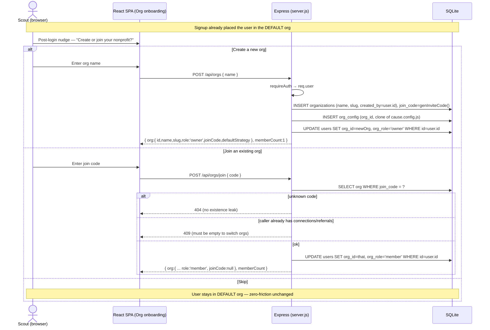

# Multi-tenancy — org model, roles, onboarding & data isolation

[← Docs index](./README.md) · [Architecture](./architecture.md) · [Data model](./data-model.md) ·
[Fundraising strategies](./fundraising-strategies.md)

> **Status:** approved by the PM; **this round makes org-scoping REAL**. The schema foundation
> (`org_id` columns, `organizations`/`org_config`, a seeded `default` org with all rows backfilled)
> already shipped; what was missing was **enforcement**. Every data query scoped only by `user_id`,
> there were no roles, and there was no org onboarding. This doc is the design the Builder
> implements: the org model, owner/admin/member roles, the create/join onboarding flow, and — most
> importantly — the **data-isolation convention that MUST be applied to every org-owned query**.

## The org model

An **organization** is a nonprofit tenant (the `organizations` table). Every org-owned row belongs
to exactly **one** org via `org_id`, and a **user belongs to exactly one org** (`users.org_id`).
Single-org membership keeps isolation simple and matches the seeded model — multi-org membership is
explicitly out of scope.

Org-owned tables (every one carries `org_id`):
`users`, `connections`, `referrals`, `code_x_impact`, `teams` (and `team_members` *through* its
team), `contact_history`, `voice_profiles`. `org_config` is keyed by `org_id` and holds the per-org
**cause economics + affinity keywords + `defaultStrategy`**.

- The **`default` org** (`slug = 'default'`, seeded from `cause.config.js`, all legacy rows
  backfilled) is preserved unchanged. Existing users/data stay in it, and the **demo user stays in
  it**. Zero-friction LinkedIn/demo signup keeps assigning `DEFAULT_ORG_ID` via
  `setUserOrgIfNull`, so signup is unchanged.
- **Creating a new org** seeds an `org_config` row by **cloning `cause.config.js` defaults**, so a
  fresh org is immediately usable.

## Roles

A new column **`users.org_role` (`TEXT DEFAULT 'member'`)** carries the org-level role:

| Role | Capabilities |
| --- | --- |
| **owner** | Everything an admin can, plus: manage `org_config` (cause economics + default strategy), change member roles, assign/transfer admin. Exactly one per org. Cannot be demoted while sole owner. |
| **admin** | Manage `org_config`, invite/remove members, rotate the join code. **Cannot** remove the owner or change who the owner is. |
| **member** | Normal scout: import connections, run the pipeline, see **only their own** connections/referrals/impact plus the org-wide leaderboard. |

**Backfill (idempotent, at boot in the existing migration block):**
- Set `org_role = 'member'` where NULL.
- Promote one **owner per org**: `organizations.created_by` if present, else `MIN(users.id)` in that
  org, so the `default` org always has an administrator.

The **org creator becomes owner**. `requireOrgRole(...roles)` middleware (layered *on top of*
`requireAuth`) gates admin endpoints; the role is read from `req.user.org_role`.

## Onboarding — create / join

Orgs get their **own** invite path, distinct from team invite codes:
`organizations.join_code` (`TEXT UNIQUE`, generated with the existing `genInviteCode()` pattern;
backfill the default org with a generated code).

Three flows:

1. **Default path (unchanged):** LinkedIn/demo signup assigns `DEFAULT_ORG_ID`. A post-login client
   nudge invites default-org users to optionally create or join a real org; **skipping leaves them
   in the default org**.
2. **Create org** — `POST /api/orgs { name }` → creates the org, clones default cause config into
   `org_config`, sets the caller's `org_id` + `org_role='owner'`, generates a `join_code`.
3. **Join org** — `POST /api/orgs/join { code }` → moves the caller into that org as `member`.
   **Hard rule to avoid orphaning cross-org rows:** a user may only join while they have **zero
   connections/referrals** (otherwise **409**). Switching orgs never re-stamps another user's rows.



`owner`/`admin` can rotate the join code (`POST /api/orgs/join-code/rotate`) and set the org default
strategy + cause config (`PATCH /api/orgs/config`) from a new Org settings section.

## Data isolation — THE convention the Builder MUST follow

> **Headline security requirement.** A user in org A can **never** read or write org B's
> connections, referrals, impact, contact_history, voice_profiles, dossiers, teams, or members.
> This is a privacy control (donor data, private message snippets, the scout's own voice sample),
> not just a feature.

### The mandated rules (apply to EVERY org-owned statement)

1. **`org_id` comes ONLY from the session.** Derive it from `req.user.org_id` — never from the
   request body, params, or query. Use a single helper:
   ```js
   function orgScope(req) { return req.user.org_id || DEFAULT_ORG_ID; }
   ```
2. **Per-scout reads/writes filter by `(user_id, org_id)`.** Every existing
   `WHERE ... user_id = ?` becomes `WHERE ... user_id = ? AND org_id = ?`, with `org_id` bound from
   `orgScope(req)`.
3. **Org-wide reads filter by `(org_id)`** (e.g. org member list, org leaderboard).
4. **All inserts stamp `org_id` from `req.user`** — connections, referrals, code_x_impact, teams,
   contact_history, voice_profiles. Never accept an `org_id` from input.
5. **Direct-object access returns 404, not 403, across orgs.** `GET/PATCH/DELETE
   /api/connections/:id`, `/api/referrals/:id`, and `/api/connections/:id/dossier` must return
   **404** for an id that exists in another org — existence is not leaked.
6. **Teams are org-scoped.** A team's `org_id` = creator's `org_id`; join-by-code only succeeds if
   the code's team is in the caller's org, otherwise the **same 404** as an unknown code (no
   existence leak).
7. **No raw SQL string interpolation of `org_id`/`user_id`.** All values go through
   `better-sqlite3` prepared-statement parameters (the existing pattern).

### Request-scoping flow (every authenticated data request)

```mermaid
flowchart TD
  R[/api/* request] --> A{requireAuth\nreq.isAuthenticated?}
  A -- no --> E401[401 Not authenticated]
  A -- yes --> U["req.user = full users row\n(incl. org_id, org_role)"]
  U --> ORG["orgScope(req) = req.user.org_id\n(NEVER from body/params)"]
  ORG --> ROLE{"admin endpoint?\nrequireOrgRole(owner,admin)"}
  ROLE -- forbidden --> E403[403]
  ROLE -- ok / not required --> Q["prepared stmt bound with\n(user.id, orgId) or (orgId)"]
  Q --> DOR{"object id in another org?"}
  DOR -- yes --> E404[404 — no existence leak]
  DOR -- no --> H[handler returns scoped rows]
```

### How `default` org data migrates

- The `default` org already exists (seeded from `cause.config.js`) with **all legacy rows
  backfilled** into it — nothing moves out of it.
- This round, the migration block additionally (idempotently): sets `org_role='member'` where NULL,
  promotes one owner per org, generates `organizations.join_code` where NULL, and **stamps `org_id`
  from each row's owning user** on `contact_history`/`voice_profiles` (extending the existing
  backfill loop for `users`/`connections`/`referrals`/`teams`/`code_x_impact`).
- **Backfill is idempotent and derives `org_id` from the owning user's `org_id`**, so no row is ever
  assigned to the wrong org. Existing default-org users keep every connection, referral, impact
  record, dossier, and team membership after upgrade.

## Privacy & the "delete my data" promise

`DELETE /api/history` (wiping `contact_history` + `voice_profiles`) keeps working **per-user**, and
now also stays **org-scoped** — it can only ever touch the caller's own rows in the caller's org.
Demo mode stays in the default org, and demo seed/clear cannot touch other orgs' data.

## API contract (new + changed)

**New — Orgs & roles:**

| Endpoint | Auth | Behavior |
| --- | --- | --- |
| `GET /api/orgs/me` | any | `{ org:{ id,name,slug,role,joinCode|null (owner/admin only),defaultStrategy }, memberCount }` |
| `POST /api/orgs { name }` | any | Creates org; caller becomes owner. **400** if name missing. |
| `POST /api/orgs/join { code }` | any | Join as member. **404** unknown code; **409** if caller already has connections/referrals. |
| `GET /api/orgs/members` | owner/admin | `{ members:[{ id,name,email,role,raised,donations }] }` scoped to caller org. |
| `PATCH /api/orgs/members/:id { role }` | owner (admin may set member↔admin, not owner) | Updates `org_role`; cannot demote the sole owner. |
| `POST /api/orgs/join-code/rotate` | owner/admin | `{ joinCode }`. |
| `PATCH /api/orgs/config` | owner/admin | Updates `org_config.config_json` (impact economics, affinity keywords, `defaultStrategy`); validates `defaultStrategy ∈ registry`. |

**Changed:** `GET /api/auth/me` (`publicUser`) now also returns `orgId`, `orgRole`, `strategy`
(resolved), `orgDefaultStrategy`. `POST /api/team` / `POST /api/team/join` stamp the caller's
`org_id` and reject cross-org join codes as 404. Every other data route keeps its caller-facing
semantics but its underlying queries now additionally filter by the caller's `org_id`.

## Out of scope

Multi-org membership; migrating an existing user's data between orgs (join requires an empty
account); SSO/SCIM/domain auto-join; org billing/plan tiers; a public org directory/discovery
(invite-code only); row-level audit logging of cross-org attempts (basic 404s only).
</content>
</invoke>
