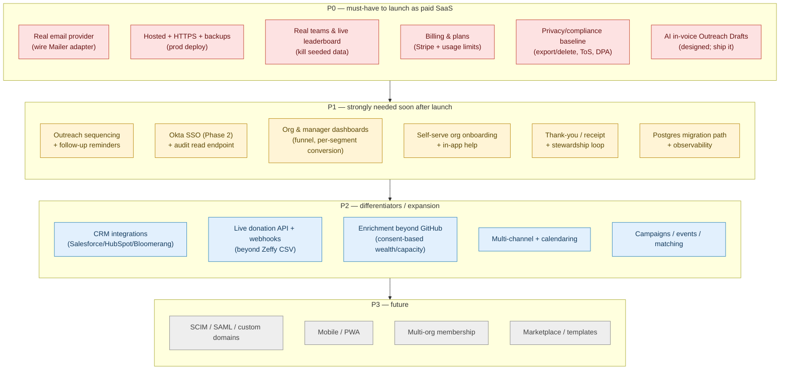

# Product Roadmap — Donor Scout

[← Docs index](./README.md) · [Architecture](./architecture.md) · [Multi-tenancy](./multi-tenancy.md) · [SaaS auth plan](./saas-auth-okta.md) · [AI outreach drafts](./ai-outreach-drafts.md)

> **Author:** Product Management. **Status:** strategic roadmap (not an implementation spec).
> **Purpose:** take Donor Scout from "strong foundation + impressive demo" to a **complete, sellable,
> multi-tenant SaaS** for nonprofit peer-to-peer (P2P) fundraising. Every recommendation below is
> grounded in the code and docs as they exist on `rebuild/strategy-multitenancy`. Features already
> shipped are **not** re-proposed — they are the platform this builds on.

## What already exists (the platform — do NOT rebuild)

Grounded in the code + `docs/`:

- **Relationship-led scoring + selectable Strategy** — `scoreProspect` persists three component
  sub-scores (affinity / propensity / capacity); a pluggable `STRATEGIES` registry recombines them
  per-user with an org default. Relationship-first is the recommended default and the ethical thesis.
  ([fundraising-strategies.md](./fundraising-strategies.md))
- **AI Donor Dossiers** — grounded, no-fabrication per-contact briefs via `lib/ai.js`, cached on the
  connection row, budget-guarded, degrades gracefully with no API key. ([ai-engine.md](./ai-engine.md))
- **Enforced multi-tenancy** — `org_id` on every owned table, session-derived org scope on every
  query, owner/admin/member roles, create/join onboarding, per-org cause config + economics.
  ([multi-tenancy.md](./multi-tenancy.md))
- **SaaS auth Phase 1** — `identities` model, passwordless magic-link, email invitations, user
  deactivation (`is_active`), append-only `audit_log` scaffold, pluggable `lib/mailer.js`
  (console-default Adapter with a real-provider seam). ([auth.md](./auth.md))
- **Ops baseline** — Docker (multi-stage, native `better-sqlite3`, single-origin SPA), Colima local
  runtime, GitHub Actions CI (tests + build). ([containerization.md](./containerization.md))
- **Pipeline + impact** — `referrals` with `to_ask → asked → following_up → donated → declined`
  statuses and a `follow_up_date` field; Zeffy CSV donation reconcile; `code_x_impact` in concrete
  units (`$800 = 1 student funded`).

**Planned-but-unbuilt (already designed):** AI in-voice Outreach Drafts
([ai-outreach-drafts.md](./ai-outreach-drafts.md)); Okta SSO (Phase 2) and SCIM/SAML/custom
domains/billing (Phase 3) ([saas-auth-okta.md](./saas-auth-okta.md)).

## The honest assessment — prototype vs. product

Three "shipped" capabilities are **demo-grade and must be productionized** before this is sellable.
These are not new features; they are the gap between a great demo and a paid SaaS:

1. **Email only logs to the console.** `lib/mailer.js` is a documented seam with a console adapter.
   Magic-link and invitations — *the entire account/onboarding funnel* — cannot deliver mail in
   production. Without this, no real customer can onboard a single teammate.
2. **The team leaderboard is fake.** `teamPayload()` reads real `team_members`/referral stats, but
   the only populated teams come from `demo-teammate-*` seeding (`/api/demo/seed`). A real org's team
   is empty until people join, and the "competition" a buyer sees in the demo is synthetic. Team
   `COST_PER_BOOTCAMP`/`COST_PER_DAY` is also hardcoded, not per-org — a multi-tenancy leak.
3. **No production hosting story.** SQLite single-file, no HTTPS in the default run, no backups, no
   audit *read* endpoint. The container exists; the hosted, TLS-terminated, backed-up deployment does
   not. SSO + Secure cookies are blocked on this.

Everything else below is genuinely new feature work, prioritized against it.

## Priority map (now / next / later)

---

## P0 — Must-have to launch as a paid SaaS

| # | Feature | One-liner | User / buyer value | Effort | Dependencies |
|---|---------|-----------|--------------------|--------|--------------|
| P0-1 | **Real email delivery** | Wire a real Mailer adapter (SMTP/`nodemailer` or an HTTP provider — Postmark/SES/Resend) behind the existing `lib/mailer.js` seam; verified sending domain + templates. | Without it, magic-link sign-in and invitations cannot reach anyone — the *entire* onboarding funnel is dead in prod. Table-stakes. | **S** | `lib/mailer.js` seam (exists); a verified domain; one runtime dep (the seam explicitly allows it). |
| P0-2 | **Hosted deployment + HTTPS + backups** | Stand up the container behind TLS (proxy/LB), `NODE_ENV=production` + strong `SESSION_SECRET`, automated SQLite snapshots (or P0→Postgres, see P1-5) off the mounted volume, health checks. | Secure cookies, SSO, and "we won't lose your donor data" all require this. No nonprofit pays for an app that can't promise durability. | **M** | Containerization (exists); a host (Fly/Render/ECS); DNS. |
| P0-3 | **Real teams & live leaderboard** | Replace `demo-teammate-*` seeding with real team membership in the org; compute the leaderboard from real members only; make team impact economics per-org (kill hardcoded `COST_PER_BOOTCAMP`). Keep demo seeding behind demo mode only. | The leaderboard is the motivational engine of P2P fundraising. A buyer must see *their* team compete, not synthetic data. Current state is a demo illusion. | **M** | Invitations (exists); per-org `org_config` economics (exists) — just consumed by `teamPayload`. |
| P0-4 | **Billing, plans & usage limits** | Stripe subscriptions (per-seat or per-org tiers), plan gating (e.g. AI calls/month tied to the existing `ai_usage` budget store, seat counts, connection caps), self-serve upgrade. | This is how the SaaS makes money. Plan tiers also let you cap AI spend per tenant (today the $5/day budget is global, not per-org — a real cost risk at scale). | **M** | `ai_usage` budget store (exists, needs per-org scoping); org model (exists); a billing dep. |
| P0-5 | **Privacy & compliance baseline** | Per-user *and* per-org data export + delete (extend the existing `DELETE /api/history`), a Terms/Privacy/DPA, a consent/opt-in record for imported contacts, and an explicit data-retention policy. Surface the "capacity sizes the ask, not who to ask" ethics as product copy. | Nonprofits handle donor PII and (via LinkedIn import) third-party contact data. GDPR/CCPA + a signable DPA are procurement blockers for any org with a board. The ethics framing is also a differentiator. | **M** | `DELETE /api/history` (exists, per-user); audit log (exists). Legal review for the documents. |
| P0-6 | **AI in-voice Outreach Drafts** | Ship the already-designed `POST /api/connections/:id/draft` — warm, in-voice, grounded ask in the existing modal, degrading to the static template. | The ask is the highest-friction, lowest-quality step in the funnel today (one static template for everyone). `voice_profiles` and `contact_history` are captured-but-unused *specifically* for this. Highest conversion lever in the product. | **S–M** | `lib/ai.js` (exists); `voice_profiles`/`contact_history` (captured); design done — [ai-outreach-drafts.md](./ai-outreach-drafts.md). |

**Why these are P0:** P0-1/2/3 close the prototype-vs-product gap (you literally cannot onboard or
durably host without them). P0-4 is the business model. P0-5 is a procurement gate. P0-6 is the
single biggest fundraising-outcome lever and is already designed — cheap, high-impact.

---

## P1 — Strongly needed soon after launch

| # | Feature | One-liner | User / buyer value | Effort | Dependencies |
|---|---------|-----------|--------------------|--------|--------------|
| P1-1 | **Outreach sequencing + follow-up reminders** ✅ *shipped* | The unused `referrals.follow_up_date` is now a real **cadence engine** (`follow_up_reminders`): marking **asked** seeds a sequence (default +3d/+1w/+2w, per-org configurable via `org_config.followUpCadenceDays`); a **reminders queue** (`GET /api/reminders`) surfaces due+overdue across the pipeline with **complete** (`POST /api/reminders/:id/complete`, advances to the next step) and **snooze** (`POST /api/reminders/:id/snooze`) actions; donated/declined closes open reminders. Surfaced on the Dashboard "Reminders due" widget and inline on the Pipeline. *Deferred:* a scheduler-driven emailed digest (the queue is pull/in-app today — no new runtime dep). | P2P conversion is won on **follow-up**, not first contact. | **M** | Mailer (P0-1, for a future digest); `referrals` statuses (exist). |
| P1-2 | **Okta SSO (Phase 2) + audit read endpoint** | Per-org BYO-IdP OIDC via the `identities`/`org_idp_config`/`org_domains` design; add the missing `GET /api/orgs/audit` reader. | Enterprise/corporate-sponsor sales require SSO; the audit *read* (table exists, no endpoint) is needed for enterprise trust. Phase 1 was built specifically to unblock this. | **L** | HTTPS (P0-2); `identities` + audit table (exist); design done — [saas-auth-okta.md](./saas-auth-okta.md). |
| P1-3 | **Org & manager analytics dashboards** | Org-level funnel, per-segment conversion (by strategy, by capacity tier, by relationship type), per-scout leaderboard with effort vs. outcome, CSV/PDF export. | Managers/EDs need to see what's working and coach scouts. "Show me our funnel and who needs help" is the manager's core job; today only per-user `/api/stats` exists. | **M** | Real teams (P0-3); `referrals`/`code_x_impact` (exist); roles (exist). |
| P1-4 | **Self-serve org onboarding + in-app help** | Polished create-org wizard (cause economics, branding/logo, default strategy), seeded sample data, contextual help/empty states, a support contact path. | Reduces time-to-value and support load; today onboarding is a minimal nudge + a profile page. Self-serve is core SaaS economics (low CAC). | **M** | Org create/config (exists); per-org cause config (exists). |
| P1-5 | **Postgres migration path + observability** ✅ *complete* | **Observability — SHIPPED:** liveness `GET /healthz` (no auth, no DB), readiness `GET /readyz` (`SELECT 1` → 200/503), and a no-new-dependency **structured request log** (method/path/status/duration/request-id; no bodies/headers/cookies/tokens/PII; quiet under `NODE_ENV=test`, gated by `LOG_REQUESTS`, probes skipped); container `HEALTHCHECK` → `/healthz`. **Postgres — PLAN authored ([postgres-migration.md](./postgres-migration.md)):** the honest sync→async cost (~374 query sites + 17 transactions), the **repository-seam** approach + the **SQLite+Litestream** alternative, phased plan, CI parity testing, data migration, risks/rollback, effort, current-vs-target mermaid. The full DB swap is marked a **deliberate, greenlight-needed** effort — *not* started blind. | SQLite single-file is fine for early tenants but a single point of failure and a write-concurrency ceiling as orgs grow. Observability is how you keep paying customers. | **L** | Hosting (P0-2). The whole DB layer is `better-sqlite3` prepared statements — a real migration cost. |
| P1-6 | **Thank-you / receipt + stewardship loop** | On `donated`, prompt an in-voice thank-you (reuse the drafts engine) and a "share impact" message; track stewardship as a pipeline stage beyond `donated`. | Retention/repeat giving is cheaper than new acquisition; the journey currently *ends* at `donated`. Closing the loop is where lifetime value lives. | **M** | AI drafts (P0-6); referral statuses (extend). |

---

## P2 — Differentiators / expansion

| # | Feature | One-liner | User / buyer value | Effort | Dependencies |
|---|---------|-----------|--------------------|--------|--------------|
| P2-1 | **CRM integrations** | Two-way sync of contacts/donations with Salesforce NPSP, HubSpot, Bloomerang, etc. | Larger nonprofits live in a CRM of record; "does it sync to Salesforce?" is a frequent gate. Differentiator + expansion revenue. | **L** | Stable donation/contact model; OAuth per provider. |
| P2-2 | **Live donation API + webhooks** | Move beyond Zeffy CSV reconcile to a webhook/API ingest (Zeffy if/when available, Stripe, Givebutter, PayPal) for real-time attribution. | Manual CSV reconcile is error-prone and lossy; real-time donation→referral attribution makes impact tracking trustworthy and instant. | **M–L** | Donation processor APIs; the reconcile logic (exists) becomes the fallback. |
| P2-3 | **Consent-based enrichment beyond GitHub** | Optional, opt-in capacity/wealth signals (e.g. wealth-screening vendors) **gated** by the relationship-first ethics — capacity sizes the ask, never picks the target. | Better ask-sizing for orgs that want it, **without** abandoning the ethical thesis. Must be opt-in and disclosed. | **M** | Vendor; the capacity sub-score (exists); explicit ethics guardrails (P0-5). |
| P2-4 | **Multi-channel + calendaring** | Send/track via email and LinkedIn natively, add SMS/WhatsApp options, and "book a coffee" calendar links. | Meets donors where they are; relationship asks often convert over a call/coffee, not a cold message. | **M** | Channel APIs; sequencing (P1-1). |
| P2-5 | **Campaigns / events / matching gifts** | Time-boxed campaigns, matching-gift multipliers, event/peer pages, shareable progress. | Campaigns and match periods are the highest-velocity moments in P2P; teams rally around a deadline. | **M–L** | Real teams (P0-3); donation ingest (P2-2). |

---

## P3 — Future

| # | Feature | One-liner | Value | Effort |
|---|---------|-----------|-------|--------|
| P3-1 | **SCIM / SAML / custom per-tenant domains** | Phase 3 enterprise: auto provision/de-provision, SAML option, `acme.donorscout.app`. | Closes large/regulated enterprise deals. | **L** |
| P3-2 | **Mobile / PWA** | Scout-on-the-go: log follow-ups, get reminders from a phone. | Engagement; volunteers aren't at a desk. | **M** |
| P3-3 | **Multi-org membership** | One person across multiple nonprofits (today: one org per user). | Power users, agencies, consultants. | **L** (changes the user↔org model + session) |
| P3-4 | **Template / playbook marketplace** | Shareable cause configs, strategies, message playbooks across tenants. | Network effect; faster onboarding. | **M** |

---

## The single most important sequencing insight

> **Productionize the funnel you already built before you build a new one.** Donor Scout's
> architecture is genuinely strong — enforced multi-tenancy, a clean AI facade, a pluggable strategy
> layer, Phase-1 auth. But three "shipped" things are demo-grade in ways that *silently block
> revenue*: email only logs to a console (no one can be invited or sign in), the leaderboard is
> seeded fake data (the buyer's own team looks empty), and there's no durable hosted home for donor
> PII. **You cannot sell, onboard, or retain a single paying org until these are real** — and each is
> small relative to its impact. Fix the plumbing, *then* expand the surface. Adding CRM sync or Okta
> on top of an app that can't email an invitation is building the second floor before the foundation.

## Recommended NEXT 3 to build (in order)

1. **Real email delivery (P0-1).** *Effort S, unblocks everything.* The magic-link + invitation
   funnel you already built is inert without it — no teammate can be onboarded, no org can grow past
   its founder. The seam exists in `lib/mailer.js`; this is wiring one adapter + verifying a domain.
   Highest leverage per hour of any item on this list. **P2P fundraising is a team sport; this is how
   the team forms.**

2. **AI in-voice Outreach Drafts (P0-6).** *Effort S–M, already designed, biggest conversion lever.*
   Relationship-led fundraising lives or dies on the ask sounding like a real note from someone who
   knows you — and today every prospect gets the *same static template*. Two captured datasets
   (`voice_profiles`, `contact_history`) exist for exactly this and are currently consumed by nothing.
   This directly moves the fundraising outcome the product is sold on, and the spec is done
   ([ai-outreach-drafts.md](./ai-outreach-drafts.md)). **It converts the demo's "wow" into dollars
   raised.**

3. **Real teams & live leaderboard (P0-3).** *Effort M, turns the demo real.* The leaderboard is the
   motivational core of P2P, and right now it's synthetic. Wiring it to real org members (and fixing
   the hardcoded, non-per-org team economics) makes the headline screen a buyer sees during
   evaluation *their* team — the difference between "neat demo" and "I can run my campaign on this."

**Why this order over (say) billing or SSO first:** SaaS economics reward *time-to-value* and *low
support cost*. Email (#1) and real teams (#3) are what make the product *usable by a real org at all*;
drafts (#2) is what makes that org *succeed and renew*. Billing (P0-4) matters, but it gates payment,
not value — you can run a design-partner/pilot tier on invoicing while these three land, and you'll
have a product worth charging for. SSO (P1-2) is a sales unlock for enterprise/corporate-sponsor
deals, but it's blocked on HTTPS/hosting and is a much larger lift; it earns its place right after the
P0 funnel is whole.
