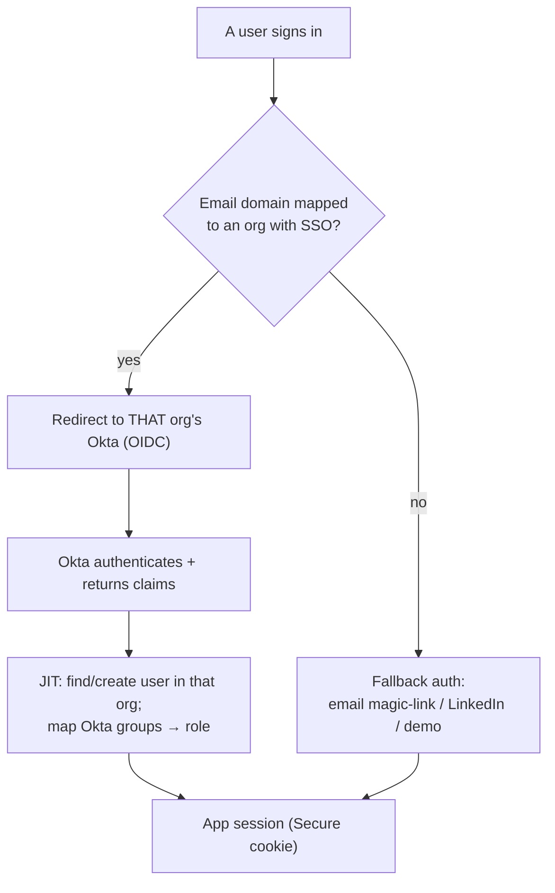
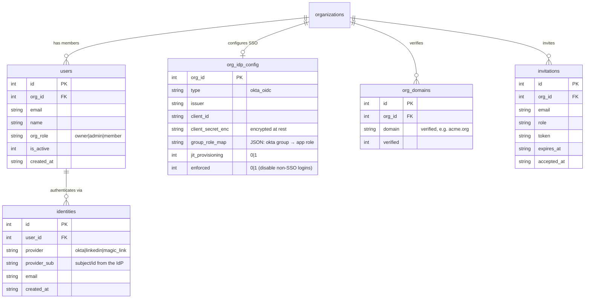
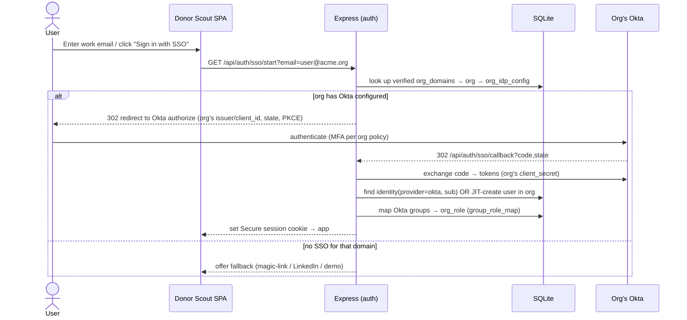

# Plan: User accounts + Okta SSO for a multi-tenant SaaS

**Status: Phase 1 SHIPPED · Phase 2 (Okta SSO / BYO IdP) IMPLEMENTED · Phase 3
PLAN.** This document designs how Donor Scout becomes a true multi-tenant SaaS:
real user accounts with lifecycle management ("user support") and enterprise
**Okta SSO per organization**, layered on the multi-tenant foundation already
shipped (see [multi-tenancy.md](./multi-tenancy.md)). The Phase 2 backend (per-org
`org_idp_config` + verified `org_domains`, email→org routing, JIT, group→role,
`enforced`) is now **built** — see [Phase 2 — as built](#phase-2--okta-sso-as-built)
below. The live end-to-end handshake still requires a real Okta tenant + HTTPS
(the hosting boundary).

## Why now

We already have organizations, `org_id` isolation on every query, and
owner/admin/member roles. What's missing for a SaaS:

1. **Identity is thin.** Auth today is Passport **LinkedIn OIDC** + a **demo
   login**; a user has a single `linkedin_id`. There's no email/password, no
   invitations, no enterprise SSO, no user lifecycle (deactivate/offboard).
2. **Enterprises require SSO.** Nonprofit teams and their corporate sponsors
   expect to sign in through their own IdP (Okta) with central provisioning and
   de-provisioning — it's table stakes for selling to organizations.

## The core decision: bring-your-own IdP, per organization

**Recommended model: each organization configures its own Okta OIDC app**
(issuer, client ID, client secret) and one or more **verified email domains**.
This is the standard enterprise SaaS pattern ("BYO IdP"): tenant A's employees
authenticate against tenant A's Okta, tenant B's against B's. A user's email
domain routes them to the right org's IdP.

Alternatives considered:
- **Single shared Okta org directory** (we own one Okta, all users in it, grouped
  by org) — simpler, but doesn't let customers use *their* IdP, which defeats the
  enterprise value. Keep only as an internal/staff option.
- **SAML instead of OIDC** — Okta supports both; we already speak OIDC
  (`passport-openidconnect`), so OIDC first, SAML as a later add if a customer
  requires it.

## Identity & user model

Today a user row conflates "person" and "credential." Split them so a person can
have multiple sign-in methods (Okta today, LinkedIn yesterday, magic-link as
fallback) without losing their identity or org membership.

Key points:
- **`identities`** decouples credentials from the person — multiple providers per
  user, and adding Okta later doesn't orphan existing LinkedIn/demo users
  (migration: backfill one `identities` row per current user from `linkedin_id`).
- **`org_idp_config.client_secret_enc`** is encrypted at rest (app-level
  encryption with a KMS-managed key or an env secret); secrets are never returned
  by the API.
- **`org_domains`** drives email→org routing and must be **verified** (DNS TXT or
  an emailed link) before it can claim users — otherwise anyone could hijack an
  org by registering its domain.
- **`enforced`** lets an org require SSO (disable magic-link/LinkedIn for its
  members) once SSO is healthy.

## SSO login flow (per-org Okta OIDC)

- **Dynamic, per-org OIDC.** We already use `passport-openidconnect`; extend it to
  resolve the strategy/config **per request from `org_idp_config`** (a strategy
  factory keyed by org), rather than one global OIDC client. This mirrors how the
  app already resolves per-org cause config and fundraising strategy.
- **JIT provisioning** (optional per org): first SSO login creates the user in the
  org as `member` (or the group-mapped role). If JIT is off, the user must have a
  pending **invitation**.
- **Group → role mapping:** Okta group claims map to `owner`/`admin`/`member` via
  `group_role_map`, so role changes in Okta propagate on next login.

## "User support" — lifecycle & management (independent of SSO)

These make it a product real teams can run, and most don't require Okta:

- **Invitations:** owner/admin invites by email + role → emailed token → invitee
  accepts and lands in the org. (Generalizes today's org join-code.)
- **Fallback auth for non-SSO orgs:** passwordless **email magic-link** is the
  recommended baseline (no password storage). LinkedIn OIDC stays as an option;
  demo login remains for evaluation.
- **Member management:** list/search members, change roles (already built),
  **deactivate** (`is_active=0` blocks login, preserves their data/attribution),
  transfer ownership.
- **Profile:** name, email, notification prefs; the existing scout fields
  (company/city/schools) and per-user fundraising **strategy** already live here.
- **Audit log:** record auth events, role changes, IdP config changes, and
  data exports per org — needed for enterprise trust.
- **Later — SCIM 2.0:** let Okta provision/de-provision users automatically
  (offboarding a sponsor in Okta disables them here). Phase 3.

## How it builds on what exists

| Existing | Reused / extended |
| --- | --- |
| `express-session` + SQLite session store | unchanged; SSO just establishes the session |
| `passport-openidconnect` (LinkedIn) | extended to a **per-org OIDC strategy factory** for Okta |
| Org model + `org_id` isolation | every new table (`identities`, `org_idp_config`, `org_domains`, `invitations`) is org-scoped the same way |
| owner/admin/member roles | targets of Okta group mapping; IdP config is owner/admin-only |
| `secure: IS_PROD` cookie | **requires HTTPS** → see [containerization.md](./containerization.md); SSO must run behind TLS |

## Security must-haves

- **HTTPS everywhere** (Secure + `SameSite` cookies, HSTS). SSO + Secure cookies
  don't work over plain HTTP — couples directly to the container/TLS deployment.
- **Encrypt `client_secret` at rest**; never log tokens; rotate on demand.
- **OIDC hardening:** PKCE, `state`/nonce validation, exact redirect-URI
  allow-listing, ID-token signature + issuer/audience verification.
- **Domain verification before claiming users** (anti-takeover).
- **CSRF protection** on state-changing routes once cookie auth spans more flows.
- **Tenant isolation stays the invariant:** `org_id` from the session, never from
  IdP-supplied input; an Okta token for org A can never resolve to org B.

## Phased rollout

| Phase | Scope | Outcome |
| --- | --- | --- |
| **1 — Accounts & invites** | `identities` table + migration; email magic-link auth; invitations; deactivate; audit scaffold | Real user accounts + team onboarding without LinkedIn/demo. No Okta yet. |
| **2 — Okta SSO (BYO IdP)** ✅ | `org_idp_config` + `org_domains` (verified); per-org OIDC via **openid-client**; domain routing; JIT provisioning; group→role mapping; `enforced` toggle | **IMPLEMENTED** — an org configures its Okta and its people sign in via SSO. |
| **3 — Enterprise** | SCIM provisioning/de-provisioning; SAML option; custom domains/subdomains per tenant; full audit export; (billing/plans if going commercial) | Sellable enterprise SaaS. |

Phase 1 is independent of Okta and unblocks everything; Phase 2 is the headline
SSO; Phase 3 is the enterprise polish.

## Phase 2 — Okta SSO, as built

The Phase 2 backend is implemented in `server.js` plus two new pure, offline-
testable modules: `lib/secrets.js` (secret encryption) and `lib/sso.js` (the
claims→user resolver). The OIDC flow uses the vetted **`openid-client`** library
(the one new runtime dependency for this feature) for discovery, PKCE, state,
nonce, code exchange, and ID-token signature/issuer/audience verification —
hand-rolling JWT verification would be a security anti-pattern.

### New tables

- **`org_idp_config`** (PK `org_id`) — `type='okta_oidc'`, `issuer`, `client_id`,
  `client_secret_enc`, `group_role_map` (JSON), `jit_provisioning`, `enforced`.
- **`org_domains`** — `org_id`, `domain` (globally `UNIQUE`), `verified`,
  `verify_token`.

See [data-model.md](./data-model.md) for the full column notes.

### Secret encryption at rest

`lib/secrets.js` exposes `createSecretBox()` → `{ encrypt, decrypt }` using
**AES-256-GCM** (node:crypto), with a 32-byte key derived (sha256) from the
`SECRETS_KEY` env var. **Production requires `SECRETS_KEY`** (the box throws at
boot if absent); non-prod falls back to a clearly-labeled **insecure dev key with
a one-time warning**, so the app stays bootable + testable with zero config. The
wire format is `v1:<iv>:<tag>:<ciphertext>` (base64). The plaintext secret lives
only in memory for the duration of an SSO request and is **never returned by any
API** — `publicIdpConfig()` exposes only a `hasClientSecret` boolean.

### Admin endpoints (owner/admin, org-scoped via `orgScope(req)`)

| Endpoint | Purpose |
| --- | --- |
| `GET /api/orgs/sso` | Read the IdP config (secret stripped) + domains + the exact `redirectUri` to allow-list in Okta |
| `PUT /api/orgs/sso` | Create/update the Okta config (secret encrypted on write; omit on update to keep it); validates `groupRoleMap` |
| `DELETE /api/orgs/sso` | Remove the config (fallback logins remain) |
| `POST /api/orgs/sso/domains` | Add a domain (starts **unverified**; globally unique → 409 if claimed) |
| `GET /api/orgs/sso/domains` | List this org's domains |
| `POST /api/orgs/sso/domains/:id/verify` | Flip `verified=1` (the DNS-TXT/email check is **stubbed**; the gate is real) |
| `DELETE /api/orgs/sso/domains/:id` | Remove a domain (this org only) |

### SSO flow

- `GET /api/auth/sso/start?email=` — resolves a **verified** domain → org → IdP
  config (`resolveOrgForEmail`), runs `openid-client` discovery, and 302-redirects
  to that org's Okta with **PKCE + state + nonce** (all stashed server-side in the
  session). A non-routing domain bounces back to the login page so the SPA offers
  the fallback methods.
- `GET /api/auth/sso/callback` — `openid-client`'s `authorizationCodeGrant()`
  verifies state, PKCE, and the ID-token (signature via JWKS + issuer + audience +
  nonce), then hands the **already-verified claims** to the pure resolver.

### The pure claims→user resolver (`lib/sso.js`)

`resolveSsoUser({ claims, org, config, ops })` is a **pure function** (the DB is
injected via `ops`) so the security-critical logic is unit-testable without a
network. Resolution order:

1. **Existing `okta` identity** → that user (re-applying group→role). If their org
   ≠ the resolving org → **`cross_org` reject**; if deactivated → **reject**.
2. **Existing user by email IN THIS ORG** → attach an `okta` identity, apply role.
3. **No user** → if `jit_provisioning` on, **JIT-create** in this org with the
   group-mapped role (default `member`); else require a **live invitation** for
   this org (org/role from the invite ROW) or **reject**.

**Tenant isolation invariant:** `org_id` and `role` come from the matched
org/invite ROW + `group_role_map`, **never** from IdP-supplied input. The resolver
also re-asserts `claims.iss === config.issuer` (**`issuer_mismatch` reject**), so
an Okta token minted for org A can never resolve a user in org B — backed by the
globally `UNIQUE(domain)` routing.

`enforced` disables non-SSO logins (magic-link consume + LinkedIn callback return
403 `SSO_REQUIRED_MSG` for a member whose org enforces SSO).

### Offline testing & the real-Okta caveat

The live handshake needs a real Okta + HTTPS and **cannot run in CI**. Tests
(`test/sso.test.js`, 21 cases) cover the security logic offline: the secret-box
encrypt/decrypt round-trip + tamper detection + "secret never returned"; the
verified-domain gate + global-uniqueness; `resolveSsoUser` (JIT create, existing
match, group→role, deactivated block, cross-org, issuer mismatch, JIT-off/invite);
and the `enforced` toggle. They drive the resolver directly **and** through a
`NODE_ENV=test`-only fake-claims hook `POST /api/test/sso-callback` (mirrors
`/api/test/login`) that feeds **injected, already-verified claims** into the same
finalize path the real callback uses. The discovery/code-exchange/token-
verification network steps are **not mocked** — they require a live Okta tenant +
HTTPS (Secure cookies + the OIDC `redirect_uri` allow-list), i.e. the hosting
boundary in [containerization.md](./containerization.md).

## Open decisions (for product/eng to confirm)

1. **BYO-IdP-per-org (recommended) vs. shared directory** — confirm the
   enterprise model.
2. **Fallback auth:** magic-link (recommended) vs. email+password vs. keep
   LinkedIn-only for non-SSO orgs.
3. **One org per user (today) vs. multi-org membership** — multi-org changes the
   `users`↔`org` relationship and the session's "current org" concept.
4. **Secret storage:** env-key encryption vs. a managed KMS / secrets manager.
5. **Tenant addressing:** path-based vs. subdomain-per-tenant
   (`acme.donorscout.app`) for IdP routing and branding.
6. **Commercial scope:** is billing/metering in or out for v1?

## Out of scope (for this plan)

Billing/subscriptions, SAML, custom per-tenant domains, and SCIM are noted as
Phase 3 / future and intentionally not designed in detail here.
